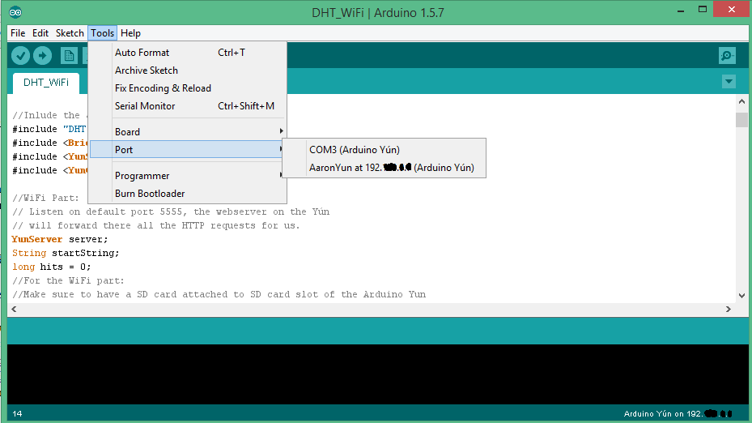
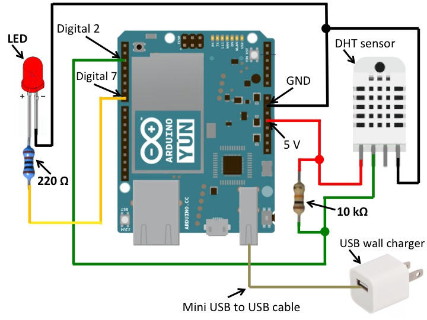
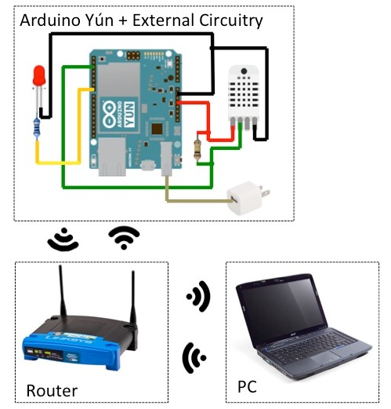
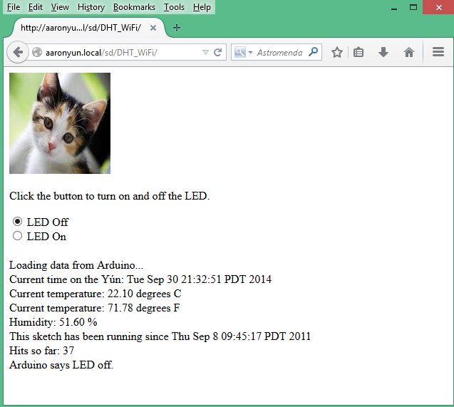
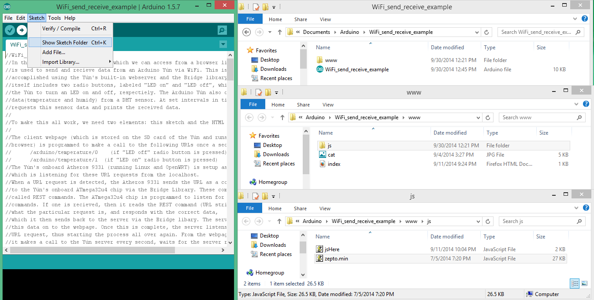
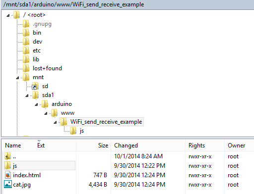
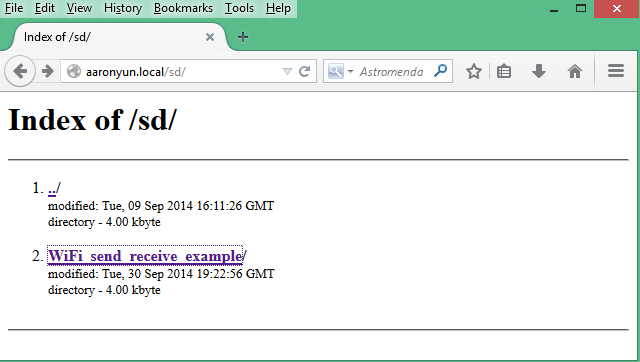
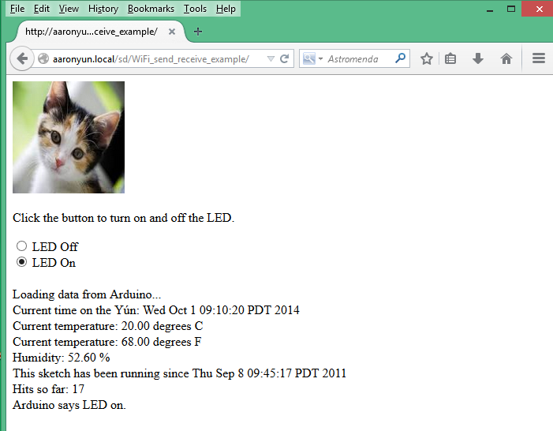
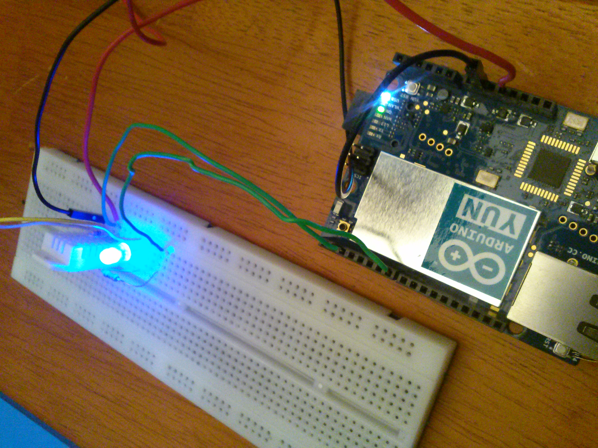

# Arduino Yun WiFi Tutorial

**Prepared by Dr. Aaron Scher**
*Oregon Institute of Technology*

!!! note "Historical Context"
    This tutorial was originally created in 2014 for the Arduino Yun. While the Arduino Yun is now a legacy product, the concepts demonstrated here (WiFi sensor monitoring, REST APIs, web-based control) remain highly relevant and can be applied to modern platforms like ESP32, ESP8266, Raspberry Pi Pico W, and Arduino MKR WiFi boards.

## Overview

This tutorial demonstrates how to serve data from an analog input and control a digital output via WiFi using the Arduino Yun's built-in webserver and Bridge library. The project includes:

- **Temperature & Humidity Monitoring**: Reading data from a DHT22 sensor accessible via web browser
- **Remote LED Control**: Turning an LED on/off through a web interface
- **REST API Implementation**: Using URL requests to communicate between web client and Arduino

The tutorial goes step-by-step from unboxing the Arduino Yun to having a working WiFi-enabled IoT system.

!!! info "Credits"
    This tutorial draws heavily from Arduino's [Temperature Web Panel Example](http://arduino.cc/en/Tutorial/TemperatureWebPanel).

## Materials List

1. **Arduino Yun** - Available from [Sparkfun](https://www.sparkfun.com/products/12053) (Legacy product)
2. **MicroSD card** - 8GB+ microSDHC (brand/size not critical)
3. **DHT-22 Temperature/Humidity Sensor** - Available from [Adafruit](http://www.adafruit.com/products/385)
   - Includes 10kΩ pull-up resistor
4. **5mm LED** - Basic LED like [this one](https://www.sparkfun.com/products/9590)
5. **Resistor** - 220Ω for LED current limiting
6. **Breadboard & Jumper Wires** - For making connections

!!! tip "Modern Alternatives"
    For new projects in 2026, consider:

    - **ESP32-C3/C6**: Built-in WiFi, more powerful, lower cost
    - **Raspberry Pi Pico W**: WiFi capability, Python/C++ support
    - **Arduino MKR WiFi 1010**: Modern Arduino with WiFi
    - **ESP8266**: Budget-friendly WiFi option

## Step 1: Prepare Your PC and Arduino Yun

### Required Software (Windows PC)

1. **Arduino IDE** - [Latest version](http://arduino.cc/en/main/software) supporting Arduino Yun
2. **Apple Bonjour Print Services for Windows** - [Download](http://support.apple.com/kb/DL999)
   - Enables Zero Configuration Networking (access Yun via local URLs)
3. **PuTTY** - [Free Telnet/SSH client](http://www.chiark.greenend.org.uk/~sgtatham/putty/)
4. **WinSCP** - [Free SFTP/FTP client](http://winscp.net/eng/index.php) (optional but useful)
5. **Text Editor** - Notepad (built-in) or [Notepad++](http://notepad-plus-plus.org/)
6. **Modern Web Browser** - Firefox, Chrome, or Edge

### Configure Yun WiFi

Follow these video tutorials to configure your Yun's WiFi:

- [Arduino Yun WiFi Configuration](https://www.youtube.com/watch?v=9-hPhWHWnvs)
- [Alternative WiFi Setup Guide](https://www.youtube.com/watch?v=OIgGUBmoIto)

### Expand Yun Disk Space

Insert the microSD card and follow Arduino's [Expanding Yun Disk Space Tutorial](http://arduino.cc/en/Tutorial/ExpandingYunDiskSpace):

- Split SD card: 4GB FAT32 (file sharing) + 4GB Linux filesystem
- FAT32 partition accessible from any computer
- Linux partition contains the Yun's file system

## Step 2: Understanding the Arduino Yun as a Webserver

### Finding Your Yun's Address

The Arduino Yun can be addressed by IP address or the name assigned during WiFi setup.

**To find your Yun's address:**

1. In Arduino IDE, go to **Tools → Port**
2. Look for entries like:
   - `COM3 (Arduino Yun)` - USB connection
   - `AaronYun at 192.XXX.X.X (Arduino Yun)` - WiFi connection



### Yun File System & Web Server Basics

The Arduino Yun can serve web pages stored on its SD card. Essential reading:

- [Arduino Yun: Intro to Web Server (PDF)](assets/arduino-yun-wifi/Arduino_Yn_Intro_to_web_server.pdf)
- [Arduino Yun: Sensor Values to HTML Page (PDF)](assets/arduino-yun-wifi/YunServer_Sensor_values_to_HTML_page.pdf)
- [Yun - How to Use SD Card (PDF)](assets/arduino-yun-wifi/Yun_How to use an SD card.pdf)

!!! warning "Prerequisites"
    Complete the "Intro to Web Server" tutorial before continuing. This ensures you understand the Yun's web serving capabilities.

## Step 3: Hardware Setup

### Circuit Schematic

Connect the Arduino Yun to the DHT22 sensor and LED as shown:



**Connections:**

- **DHT22 Sensor:**
  - Pin 1 (VCC) → 5V
  - Pin 2 (Data) → Digital Pin 2 (with 10kΩ pull-up to 5V)
  - Pin 4 (GND) → Ground

- **LED Circuit:**
  - Digital Pin 7 → 220Ω Resistor → LED Anode (+)
  - LED Cathode (-) → Ground

**Power:** USB cable connected to wall adapter or PC

### System Block Diagram



The complete system includes:

- Arduino Yun with external circuitry
- WiFi router (internet connection not required)
- PC with WiFi enabled

## Step 4: Software Implementation

### Web Interface

The web interface provides:

- Two radio buttons: "LED On" and "LED Off"
- Real-time display of temperature and humidity data
- Auto-refresh every second



### How It Works

The system uses REST API calls for communication:

**URL Commands:**

- `/arduino/temperature/0` - Turn LED off
- `/arduino/temperature/1` - Turn LED on

**Communication Flow:**

1. Web page sends URL request every second
2. Atheros 9331 (Linux/OpenWRT) receives request as server
3. Request forwarded to ATmega32u4 via Bridge library
4. ATmega32u4 processes command, reads sensor data
5. Response sent back to web page via Bridge
6. Web page updates display

### File Structure

The web files are organized as follows:

```
www/
├── index.html          # Main webpage
├── cat.jpg            # Image asset
└── js/
    ├── zepto.min.js   # jQuery-like library
    └── jsHere.js      # Custom JavaScript
```


[Download Complete Webpage Files (ZIP)](assets/arduino-yun-wifi/www.zip)

### HTML Code

The main webpage (`index.html`):

```html
<!DOCTYPE html>
<html>
<head>
</head>
<body>
  
  <br />
  <p>Click the button to turn on and off the LED.</p>

  <form id="LED_Selection" action="">
    <input type="radio" name="LEDCheck" value="off" id="off" />
    <label for="off">LED Off</label><br>
    <input type="radio" name="LEDCheck" value="on" id="on" />
    <label for="on">LED On</label><br>
  </form>
  <br />

  <div id="sensor_content">Loading data from Arduino...</div>
  <div id="LED_content"></div>
  <div id="LED_content_test"></div>

  <script type="text/javascript" src="js/zepto.min.js"></script>
  <script type="text/javascript" src="js/jsHere.js"></script>
</body>
</html>
```

### JavaScript Code

The client-side logic (`jsHere.js`):

```javascript
$(function() {
  getSensorvalue();
});

function getSensorvalue() {
  // Every one second, this function obtains sensor values from Arduino Yun
  // and sends to Yun a request to turn LED on or off (depending on radio button)

  var checked_option_radio = $('input[name=LEDCheck]:checked','#LED_Selection').val();

  if (checked_option_radio == 'off') {
    // If user selected LED off, send request to Arduino
    $('#LED_content').load('/arduino/temperature/0');
  }

  if (checked_option_radio == 'on') {
    // If user selected LED on, send request to Arduino
    $('#LED_content').load('/arduino/temperature/1');
  }

  setTimeout("getSensorvalue()", 1000); // Poll every second
}
```

### Arduino Code

The complete Arduino sketch:

```cpp
// WiFi_send_receive_example
// This example shows how to send and receive data from an Arduino Yún via WiFi
// using the Yún's built-in webserver and the Bridge library.
//
// Created by Aaron D Scher on Sep. 10, 2014
// Based on public domain codes: TemperatureWebPanel by Arduino and DHT by Adafruit

// Include libraries
#include "DHT.h"
#include <Bridge.h>
#include <YunServer.h>
#include <YunClient.h>

// WiFi setup: Listen on default port 5555
YunServer server;
String startString;
long hits = 0;

// Temperature/humidity sensor setup
#define DHTPIN 2       // DHT data pin connected to Yún digital pin 2
#define DHTTYPE DHT22  // DHT 22 (AM2302)

// Initialize DHT sensor for normal 16MHz Arduino
DHT dht(DHTPIN, DHTTYPE);

// Setup LED pin
int led = 7; // Yún digital pin 7 to LED to 220 Ohm resistor to Ground

void setup() {
  Serial.begin(9600);
  Serial.println("DHTxx test!");
  dht.begin();

  // Bridge startup
  Bridge.begin();
  // Listen for incoming connection only from localhost
  server.listenOnLocalhost();
  server.begin();

  // Get the time that this sketch started
  Process startTime;
  startTime.runShellCommand("date");
  while (startTime.available()) {
    char c = startTime.read();
    startString += c;
  }

  pinMode(led, OUTPUT); // Initialize LED pin as output
}

void loop() {
  int LED_choice;

  // Get clients coming from server
  YunClient client = server.accept();

  // Is there a new client?
  if (client) {
    // Read the URL command
    String command = client.readStringUntil('/');
    command.trim(); // Remove whitespace

    if (command == "temperature") {
      // Get current time from server
      Process time;
      time.runShellCommand("date");
      String timeString = "";
      while (time.available()) {
        char c = time.read();
        timeString += c;
      }

      // Read sensor data (takes ~250ms)
      float h = dht.readHumidity();
      float t = dht.readTemperature();        // Celsius
      float f = dht.readTemperature(true);    // Fahrenheit

      // Compute heat index (must use Fahrenheit)
      float hi = dht.computeHeatIndex(f, h);

      // Send data to client as HTML
      client.print("Current time on the Yún: ");
      client.println(timeString);
      client.print("<br>Current temperature: ");
      client.print(t);
      client.print(" degrees C");
      client.print("<br>Current temperature: ");
      client.print(f);
      client.print(" degrees F");
      client.print("<br>Humidity: ");
      client.print(h);
      client.print(" %\t");
      client.print("<br>This sketch has been running since ");
      client.print(startString);
      client.print("<br>Hits so far: ");
      client.print(hits);

      // Determine LED state from URL
      LED_choice = client.parseInt();

      if (LED_choice == 1) {
        client.print("<br>Arduino says LED on.");
        digitalWrite(led, HIGH); // Turn LED on
      }

      if (LED_choice == 0) {
        client.print("<br>Arduino says LED off.");
        digitalWrite(led, LOW);  // Turn LED off
      }
    }

    // Close connection and free resources
    client.stop();
    client.flush();
    hits++; // Increment hit counter
  }
}
```

### Uploading Files to the Yun

**Method 1: Using Arduino IDE (Recommended for first upload)**

1. In Arduino IDE, go to **Sketch → Show Sketch Folder**
2. Create a folder named `www` in the sketch folder
3. Place all web files (HTML, JavaScript, images) in the `www` folder
4. Upload the sketch - web files will automatically transfer to SD card



**Method 2: Using WinSCP (Faster for updates)**

1. Connect to Yun via WinSCP
2. Navigate to `/mnt/sd/arduino/www/`
3. Drag files directly from PC to SD card



!!! tip "Upload Strategy"
    Use Arduino IDE for first upload (creates correct directories), then use WinSCP for faster updates.

## Step 5: Testing the System

### Access the Web Interface

1. Open a web browser
2. Navigate to: `http://NAMEOFYOURYUN.local/sd/`
   - Replace `NAMEOFYOURYUN` with your Yun's name
3. You'll see a list of webpages on the SD card



4. Click on your webpage folder (e.g., "WiFi_send_receive_example")

### Control the LED

Click the "LED on" radio button to turn on the LED:





The webpage will update every second with:

- Current temperature (Celsius and Fahrenheit)
- Humidity percentage
- LED status
- Number of requests served

## Troubleshooting

!!! warning "Common Issues"
    - **Can't find Yun on network**: Ensure Bonjour is installed on Windows
    - **Sensor reads NaN**: Check DHT22 wiring and pull-up resistor
    - **Web page won't load**: Verify SD card is properly formatted and files are in `/mnt/sd/arduino/www/`
    - **LED doesn't respond**: Check LED polarity and resistor value

## Learning Outcomes

After completing this tutorial, you will understand:

- ✅ How to configure Arduino Yun for WiFi communication
- ✅ REST API concepts and implementation
- ✅ Bridge library for communication between processors
- ✅ Web-based IoT control interfaces
- ✅ Sensor data acquisition and transmission over WiFi
- ✅ Client-server architecture in embedded systems

## Next Steps

!!! success "Expand Your Project"
    - Add more sensors (light, motion, soil moisture)
    - Implement data logging to SD card
    - Create charts/graphs of sensor data over time
    - Add security (password protection, HTTPS)
    - Control multiple outputs (motors, relays, servos)
    - Integrate with MQTT for IoT platforms

## Modern Implementation

For implementing similar functionality with modern hardware (ESP32, 2026):

```cpp
// ESP32 equivalent using WiFi library and web server
#include <WiFi.h>
#include <WebServer.h>
#include <DHT.h>

const char* ssid = "your-ssid";
const char* password = "your-password";

WebServer server(80);
DHT dht(2, DHT22);
int led = 7;

void handleTemperature() {
  float t = dht.readTemperature();
  float h = dht.readHumidity();

  String message = "Temperature: " + String(t) + "°C<br>";
  message += "Humidity: " + String(h) + "%";

  server.send(200, "text/html", message);
}

void setup() {
  WiFi.begin(ssid, password);
  while (WiFi.status() != WL_CONNECTED) delay(500);

  server.on("/arduino/temperature/0", []() {
    digitalWrite(led, LOW);
    handleTemperature();
  });

  server.on("/arduino/temperature/1", []() {
    digitalWrite(led, HIGH);
    handleTemperature();
  });

  server.begin();
  dht.begin();
  pinMode(led, OUTPUT);
}

void loop() {
  server.handleClient();
}
```

---

*Original tutorial created December 2014 | Updated for modern context February 2026*
