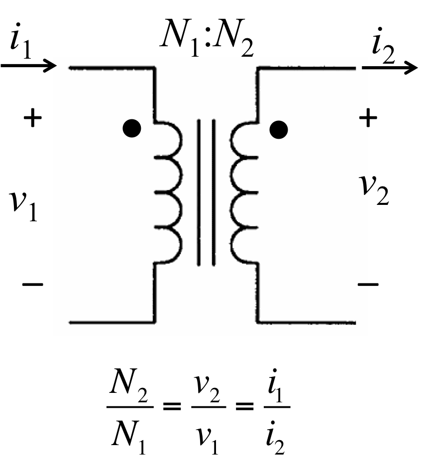
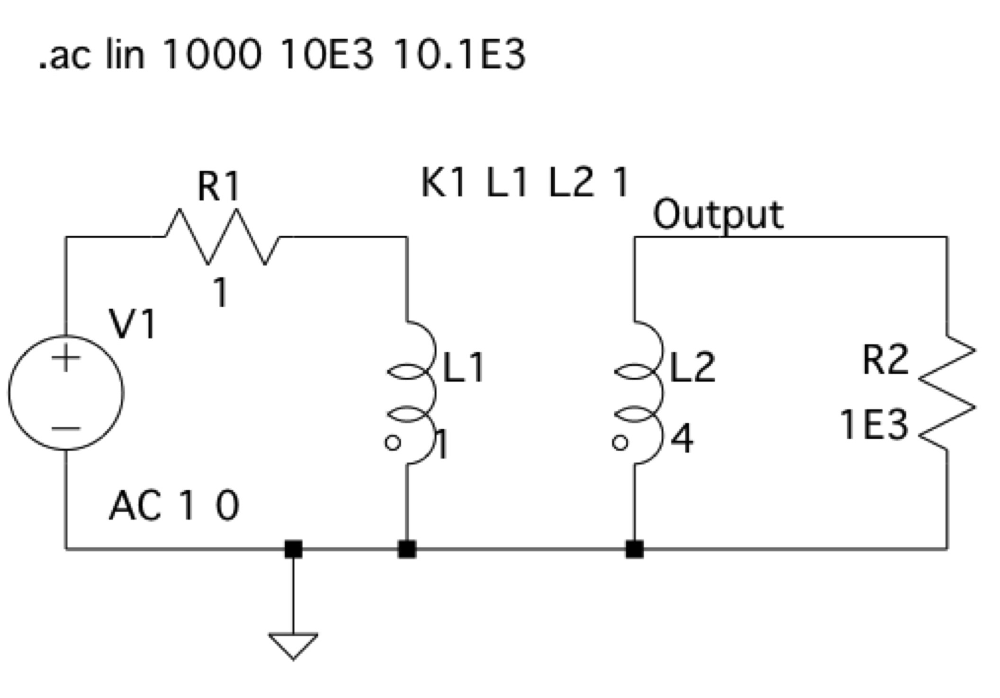
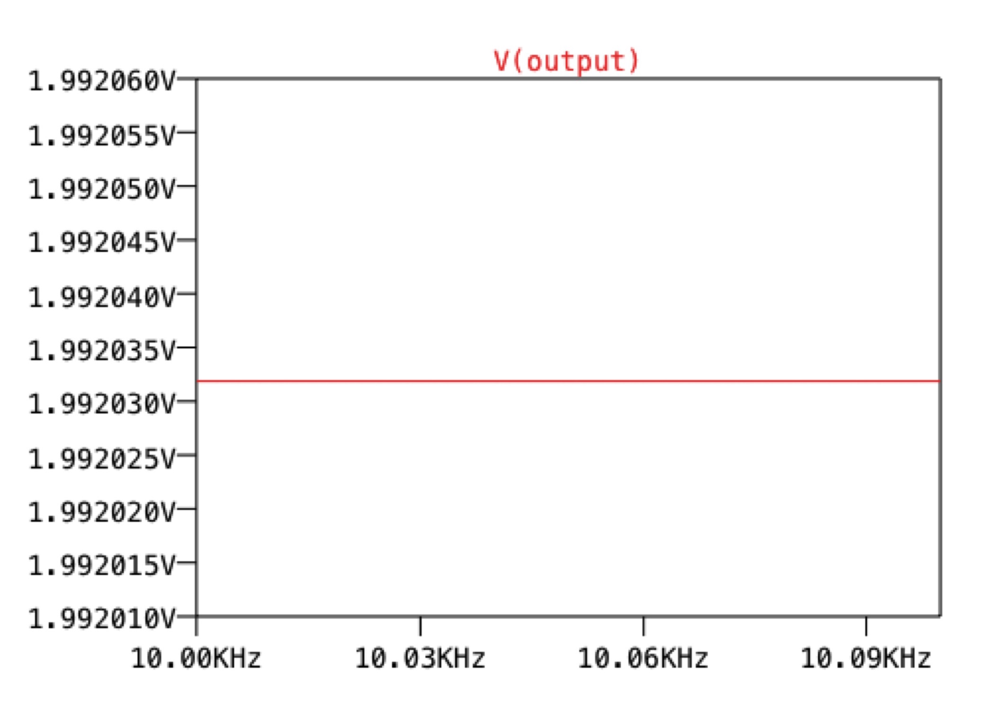
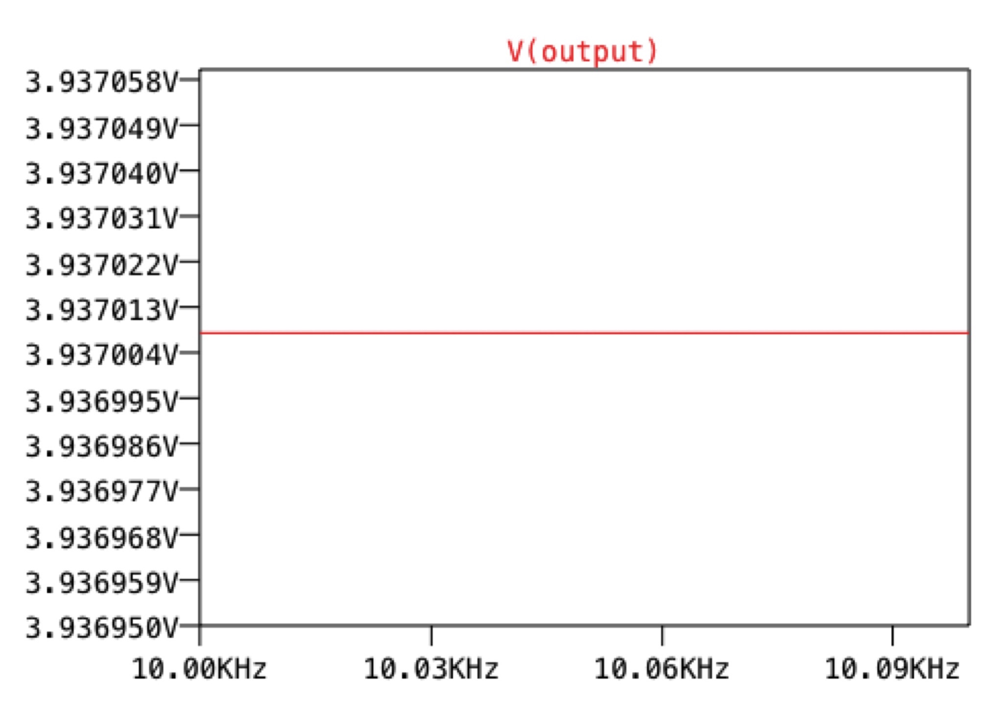
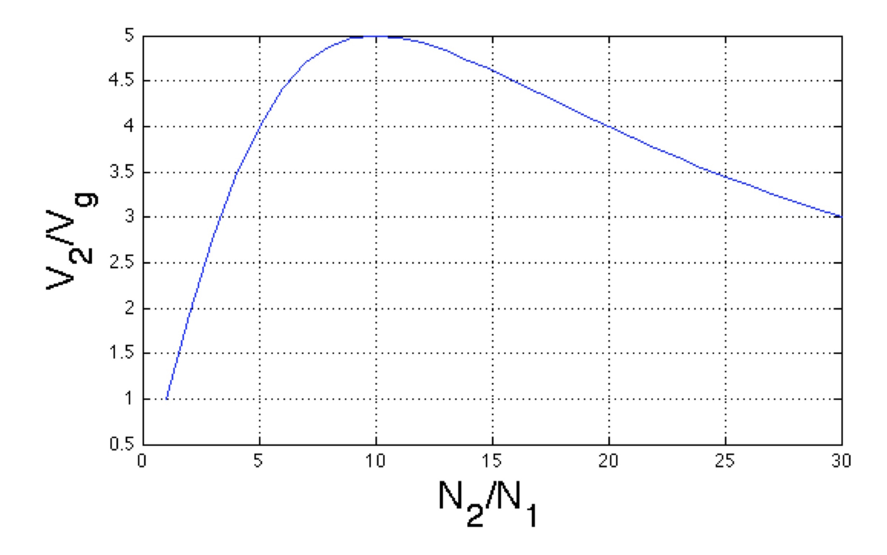
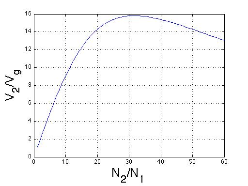

# Transformer Analysis and Impedance Matching

**Prepared by Dr. Aaron Scher**
*Oregon Institute of Technology*

## Overview

This tutorial covers the operation of ideal linear transformers, impedance transformation, and the practical limits of voltage step-up through transformers. We'll explore both theoretical principles and practical SPICE simulations to understand transformer behavior.

!!! info "What You'll Learn"
    - Ideal transformer voltage/current relationships
    - Impedance transformation through transformers
    - Maximum voltage transfer and impedance matching
    - SPICE simulation of transformers using coupled inductors
    - Practical design considerations

## Transformer Operation Fundamentals

### Ideal Linear Transformer

The ideal linear transformer relates primary and secondary voltages and currents through the turns ratio:

**Figure 1.** Ideal linear transformer voltage/current relationship

**Key Relationships:**

$$\frac{V_2}{V_1} = \frac{N_2}{N_1}$$

$$\frac{I_2}{I_1} = \frac{N_1}{N_2}$$

Where:

- $V_1$, $V_2$ = primary and secondary voltages
- $I_1$, $I_2$ = primary and secondary currents
- $N_1$, $N_2$ = number of turns in primary and secondary windings

### Impedance Transformation

One of the most powerful applications of transformers is impedance transformation:

**Figure 2.** Impedance transformation through an ideal transformer

**Impedance Transformation Equation:**

$$Z_{in} = Z_L \left(\frac{N_1}{N_2}\right)^2$$

This allows matching a load impedance $Z_L$ to a source impedance by choosing the appropriate turns ratio.

!!! note "Non-Ideal Transformers"
    For non-ideal transformers (general coupled inductors with losses and leakage inductance), see [Magnetically Coupled Equivalent Circuits](http://aaronscher.com/Impedance_matching/mag_coupled_eq_circuits/mag_coupled_eq_circuits.html).

## Example 1: Step-Up Voltage Transformer (1:2 Ratio)

### Circuit Setup

Figure 3 shows an LTSpice simulation of a 1:2 transformer designed to double the voltage across the load $Z_L = R_L$.

**Simulation Parameters:**

- Operating frequency: 1 kHz
- Load resistance: $R_L = 1$ kΩ
- Generator resistance: $R_g = 1$ Ω
- Coupling coefficient: $k = 1$ (ideal)

**Component Selection:**

To simulate an ideal transformer, the inductances must be "large" - meaning their impedance at the operating frequency is much larger than $R_g$ and $Z_L$.

For a 1:2 transformer:

$$\frac{N_2}{N_1} = 2 \quad \Rightarrow \quad \frac{L_2}{L_1} = \left(\frac{N_2}{N_1}\right)^2 = 4$$

Therefore: $L_2 = 4 \cdot L_1$

**Figure 3.** LTSpice simulation setup for 1:2 transformer

!!! warning "Grounding Requirement"
    LTSpice requires both primary and secondary sides to share a common ground, otherwise it will flag an error.

### Simulation Results

**Figure 4.** Voltage across load for the 1:2 transformer

**Observations:**

- The load voltage is close to, but not exactly, 2V
- The slight deviation from 2V is due to the voltage drop across the source resistance $R_g$
- The primary side voltage is slightly less than 1V input

## Example 2: Step-Up Voltage Transformer (1:4 Ratio)

To quadruple the voltage, we use a 1:4 turns ratio:

$$\frac{N_2}{N_1} = 4 \quad \Rightarrow \quad \frac{L_2}{L_1} = 16$$

Therefore: $L_2 = 16 \cdot L_1$

**Figure 5.** LTSpice simulation setup for 1:4 transformer

**Figure 6.** Voltage across load for the 1:4 transformer

## Maximum Voltage Obtainable Across the Load

### The Impedance Matching Principle

!!! question "Can We Get Infinite Voltage?"
    One might think that by increasing the turns ratio $N_2/N_1$ indefinitely, you can achieve any arbitrarily large voltage across the load. **This is not true!**

**The Reason:**

As you increase $N_2/N_1$, the impedance presented to the generator **decreases**:

$$Z_{in} = Z_L \left(\frac{N_1}{N_2}\right)^2$$

The larger the turns ratio, the smaller $Z_{in}$ becomes.

### Maximum Power Transfer Condition

The maximum voltage (and power) transfer occurs when the transformer is **impedance matched** to the generator:

$$Z_{in} = R_g$$

Using the impedance transformation equation:

$$Z_L \left(\frac{N_1}{N_2}\right)^2 = R_g$$

Solving for the optimal turns ratio:

$$\left(\frac{N_2}{N_1}\right)^2 = \frac{Z_L}{R_g} = \frac{L_2}{L_1}$$

This can only occur for a real load:

$$Z_L = R_L = R_g \left(\frac{N_2}{N_1}\right)^2 = R_g \left(\frac{L_2}{L_1}\right)$$

### Voltage Equation

The voltage across the load is:

$$V_2 = \frac{N_2}{N_1} \cdot V_g \cdot \frac{Z_{in}}{Z_{in} + R_g}$$

where:

$$Z_{in} = Z_L \left(\frac{N_1}{N_2}\right)^2$$

## MATLAB Analysis: Voltage vs. Turns Ratio

### Case 1: $R_g = 1$ Ω, $R_L = 100$ Ω

**Figure 7.** Normalized voltage across load as a function of turns ratio

**Key Observations:**

- Maximum voltage occurs at $N_2/N_1 = \sqrt{R_L/R_g} = \sqrt{100/1} = 10$
- Maximum normalized voltage: ~5V (for $V_g = 1$V)
- Increasing turns ratio beyond 10 **decreases** the voltage!

### Case 2: $R_g = 1$ Ω, $R_L = 1000$ Ω

**Figure 8.** Normalized voltage across load as a function of turns ratio

**Key Observations:**

- Maximum voltage occurs at $N_2/N_1 = \sqrt{1000/1} \approx 31.6$
- Maximum normalized voltage: ~16V (for $V_g = 1$V)
- Much larger voltage gain compared to Figure 7!

!!! success "Design Insight"
    We can generate **large voltages** with transformers when the load resistance is **much larger** than the generator resistance. Compare the maximum voltage ratio: ~5 (Fig. 7) vs. ~16 (Fig. 8).

## Current Through the Load

The current through the load is:

$$I_2 = \frac{V_2}{R_L}$$

Since both $V_2$ and $R_L$ are maximized at the same turns ratio, the **maximum current** also occurs at:

$$\frac{N_2}{N_1} = \sqrt{\frac{R_L}{R_g}}$$

## Design Guidelines

!!! tip "Practical Transformer Design"
    1. **Impedance Matching**: For maximum power transfer, match $Z_{in}$ to source impedance
    2. **High Load/Low Source**: Large voltage step-up requires $R_L \gg R_g$
    3. **Coupling Coefficient**: Aim for $k$ close to 1 (tight magnetic coupling)
    4. **Core Material**: Use high permeability cores (ferrite, iron) for inductance
    5. **Frequency Considerations**: Higher frequencies allow smaller core sizes
    6. **Saturation**: Avoid core saturation by limiting flux density

## Downloadable Resources

- [📥 LTSpice File: 1:2 Transformer (ideal_transformer_1.asc)](assets/transformers/ideal_transformer_1.asc)
- [📥 LTSpice File: 1:4 Transformer (ideal_transformer_2.asc)](assets/transformers/ideal_transformer_2.asc)
- [📥 MATLAB Script: Voltage Analysis (Voltage_across_Load.m)](assets/transformers/Voltage_across_Load.m)
- [📥 PowerPoint: Transformer Diagrams (transformer_images.pptx)](assets/transformers/transformer_images.pptx)

## Hands-On Exercise

!!! question "Try It Yourself"
    Using LTSpice, design a transformer to match a $50$ Ω source to a $300$ Ω load at 10 MHz:

    1. Calculate the required turns ratio
    2. Determine $L_1$ and $L_2$ values (hint: $X_L = 2\pi f L$ should be $\gg R_g$)
    3. Simulate and verify maximum power transfer
    4. Plot $V_2$ vs. turns ratio to confirm your design

    **Solution:**
    - Turns ratio: $N_2/N_1 = \sqrt{300/50} \approx 2.45$
    - Choose $L_1 = 10$ μH → $L_2 = 6L_1 = 60$ μH
    - At 10 MHz: $X_{L1} = 628$ Ω $\gg R_g = 50$ Ω ✓

## Real-World Applications

**Power Distribution:**
- Step-up transformers: Power plants to transmission lines (kV → hundreds of kV)
- Step-down transformers: Transmission lines to homes (kV → 240V/120V)

**RF & Communications:**
- Impedance matching: Antenna to transmission line (50Ω systems)
- Baluns: Balanced to unbalanced conversion
- RF transformers: Mixers, amplifiers, filters

**Audio Electronics:**
- Microphone transformers: Impedance matching
- Output transformers: Tube amps to speakers
- Audio isolation transformers: Ground loop elimination

**Switch-Mode Power Supplies:**
- Flyback transformers: Energy storage + isolation
- Forward converters: Voltage conversion with isolation

## Related Topics

- [Magnetically Coupled Circuits](http://aaronscher.com/Impedance_matching/mag_coupled_eq_circuits/mag_coupled_eq_circuits.html)
- Transmission Line Transformers
- Autotransformers
- Three-Phase Transformers
- Transformer Losses and Efficiency

## Summary

Key takeaways from this tutorial:

✅ **Ideal Transformer**: $V_2/V_1 = N_2/N_1$, $I_2/I_1 = N_1/N_2$
✅ **Impedance Transformation**: $Z_{in} = Z_L(N_1/N_2)^2$
✅ **Maximum Voltage**: Occurs at impedance match, $N_2/N_1 = \sqrt{R_L/R_g}$
✅ **Voltage Gain Limit**: Cannot be increased indefinitely - there's an optimal turns ratio
✅ **SPICE Simulation**: Model transformers using coupled inductors with $L_2/L_1 = (N_2/N_1)^2$

Understanding transformer theory is essential for power electronics, RF design, and analog circuit design. The impedance matching principle applies broadly across electrical engineering!

---

*Tutorial created December 2015*
