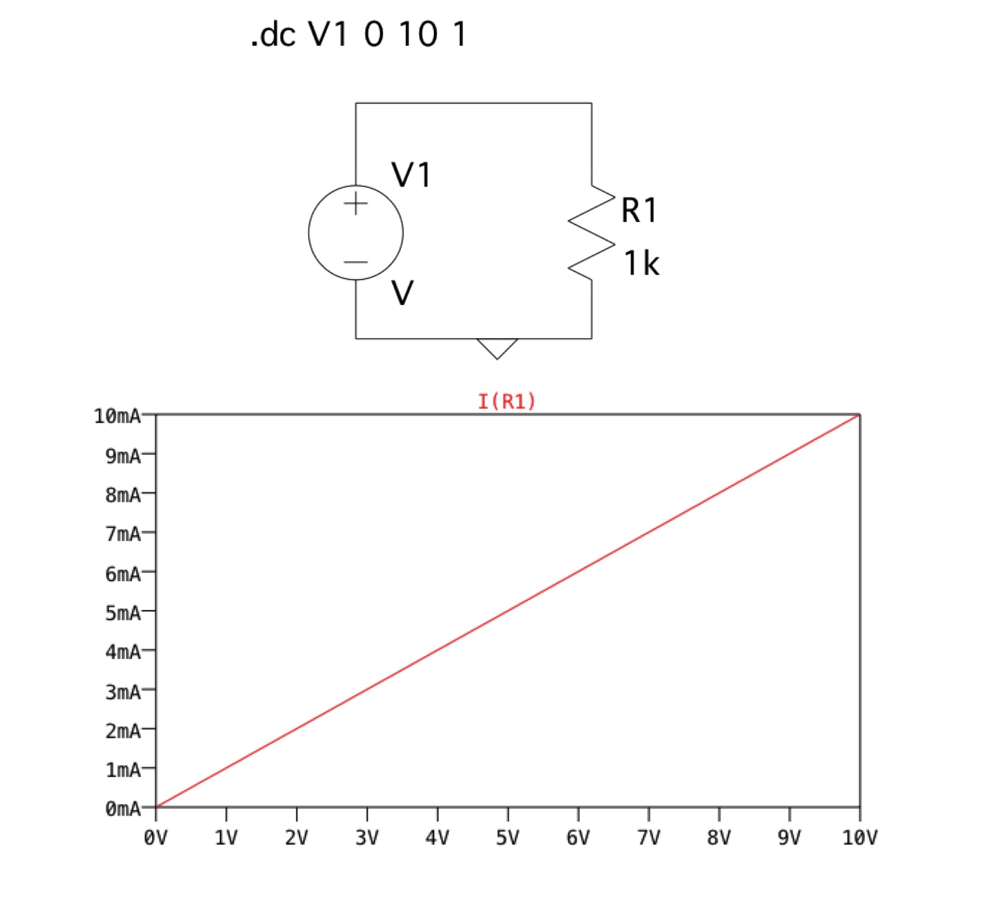
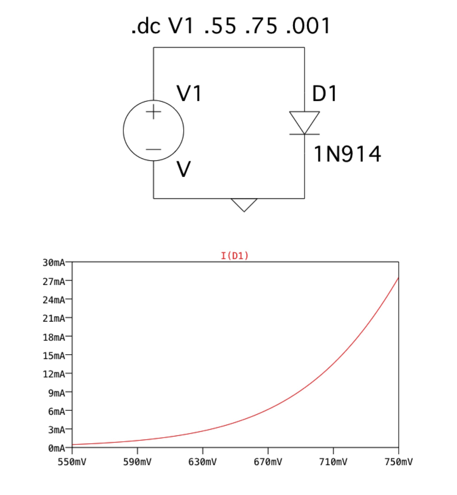
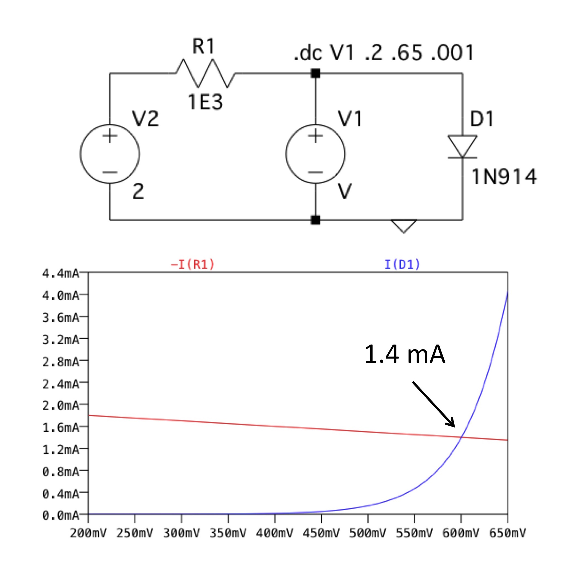
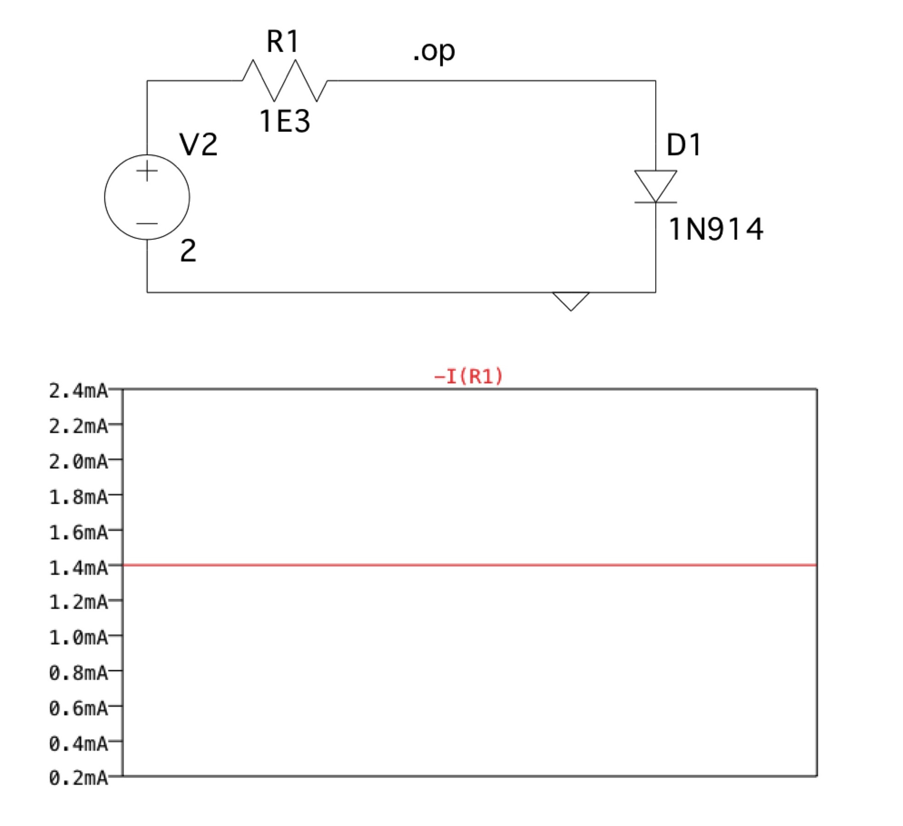
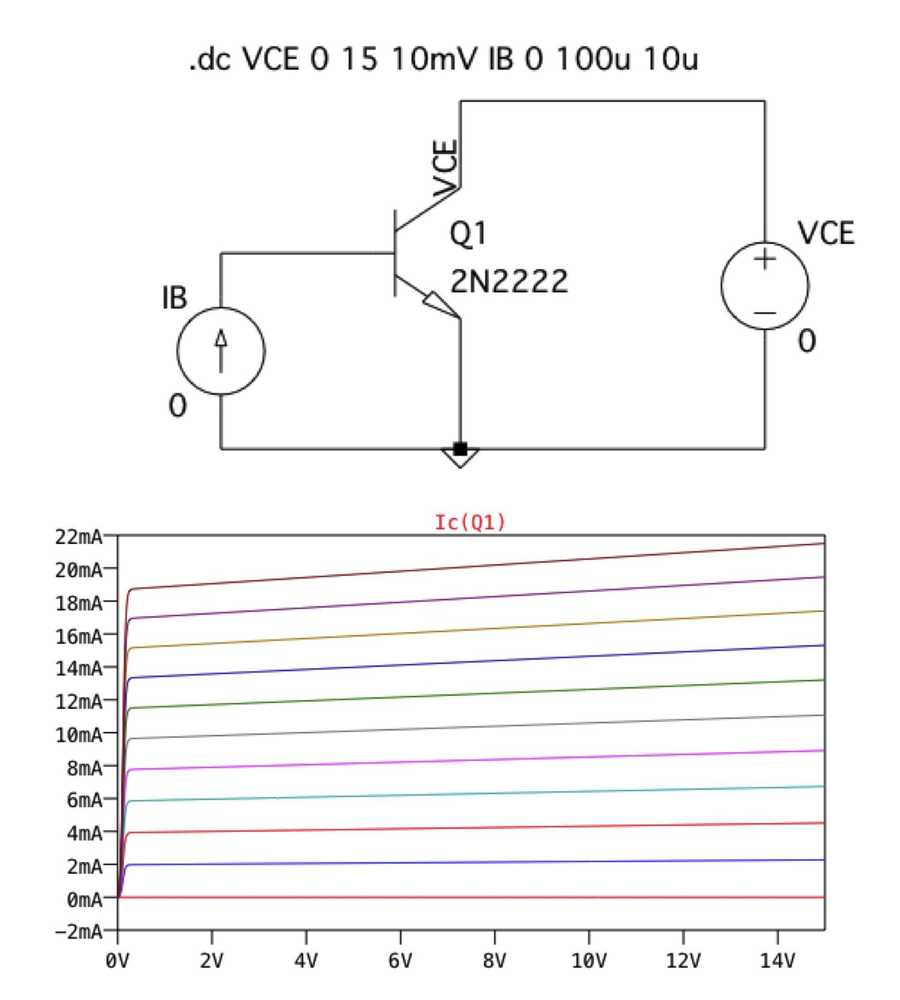

# V-I Characteristic Curves of Common Components

**Prepared by Dr. Aaron Scher**
*Oregon Institute of Technology*

## Overview

Understanding voltage-current (V-I) characteristic curves is fundamental to circuit analysis and design. This tutorial explores the V-I relationships for common electronic components: resistors, diodes, and bipolar junction transistors (BJTs). We'll also cover load line analysis - a graphical method for finding the operating point of nonlinear circuits.

!!! info "What You'll Learn"
    - V-I characteristic curves for resistors, diodes, and BJTs
    - How to interpret and use V-I curves in circuit analysis
    - Load line analysis for finding operating points
    - Verification of load line analysis using SPICE simulation

## Resistor V-I Characteristic

### Ohm's Law: The Linear Relationship

Resistors exhibit the simplest V-I relationship - a perfectly linear characteristic described by Ohm's Law:

$$V = I \cdot R$$

**Key Features:**

- **Linear**: The V-I curve is a straight line passing through the origin
- **Slope**: The slope of the line is the resistance $R$
  - Steeper slope = higher resistance
  - Shallow slope = lower resistance
- **Bidirectional**: Works in both positive and negative voltage/current quadrants
- **Power Dissipation**: $P = V \cdot I = I^2 R = V^2/R$

**Resistance Values:**

As shown in the diagram:

- Small $R$ (e.g., 10Ω): Steep current increase, shallow slope
- Medium $R$ (e.g., 100Ω): Moderate slope
- Large $R$ (e.g., 1kΩ): Shallow current increase, steep slope

!!! tip "Practical Insight"
    In the diagram, notice how higher resistance values result in less current for the same applied voltage. This is why choosing the right resistor value is crucial in current-limiting applications (LEDs, transistor biasing, etc.).

## Diode V-I Characteristic

### Exponential Nonlinear Behavior

Unlike resistors, diodes exhibit a highly nonlinear, exponential V-I characteristic:

**Key Features:**

### Forward Bias Region (V > 0)

- **Exponential increase**: $I = I_S(e^{V/nV_T} - 1)$ where:
  - $I_S$ = reverse saturation current (~pA to fA)
  - $n$ = ideality factor (1-2)
  - $V_T$ = thermal voltage (~26mV at 300K)
- **Threshold voltage**: ~0.6-0.7V for silicon diodes, ~0.3V for Schottky
- **Low forward resistance**: Once conducting, diode acts like small resistor

### Reverse Bias Region (V < 0)

- **Leakage current**: Very small reverse current (~nA to μA)
- **Breakdown voltage**: Beyond certain negative voltage, current increases rapidly (Zener/avalanche breakdown)

**Temperature Dependence:**

- Forward voltage decreases ~2mV/°C as temperature increases
- Reverse leakage current approximately doubles every 10°C

!!! warning "Power Dissipation"
    Diodes can dissipate significant power in forward bias. Always check: $P = V_F \cdot I_F < P_{max}$

## Load Line Analysis: Diode with Resistor

### Graphical Solution Method

When a diode is combined with a resistor and voltage source, we need to find the operating point where both the diode equation AND Ohm's law are satisfied. Load line analysis provides a graphical solution.

### How It Works

The circuit consists of:

- Voltage source: $V_S$
- Series resistor: $R$
- Diode: Nonlinear V-I characteristic

**Circuit Equation:**

$$V_S = I \cdot R + V_D$$

Rearranging for the load line:

$$I = \frac{V_S - V_D}{R}$$

This is a straight line with:

- **Y-intercept** (current axis): $I_{SC} = V_S/R$ (short-circuit current, when $V_D = 0$)
- **X-intercept** (voltage axis): $V_{OC} = V_S$ (open-circuit voltage, when $I = 0$)
- **Slope**: $-1/R$

**Finding the Operating Point (Q-Point):**

The **intersection** of the load line and the diode curve gives the actual operating current $I_Q$ and voltage $V_Q$.

### Example from Diagram

Looking at the load line graph:

- Voltage source: $V_S = 5$V
- Resistor: $R = 100$Ω
- Load line: From $(0, 50\text{mA})$ to $(5\text{V}, 0)$
- **Q-point**: Approximately at $V_D \approx 0.7$V, $I_D \approx 43$mA

!!! note "Why This Works"
    The Q-point is the only place where BOTH equations are satisfied:

    - The diode equation (exponential curve)
    - Kirchhoff's Voltage Law (load line)

### Verification with SPICE Simulation

Always verify graphical solutions with simulation:

The SPICE simulation confirms our load line analysis:

- **Diode voltage**: ~0.7V (matches Q-point from graph)
- **Diode current**: ~43mA (matches Q-point from graph)
- **Resistor voltage drop**: $V_R = 5 - 0.7 = 4.3$V
- **Check**: $I = V_R/R = 4.3/100 = 43$mA ✓

!!! success "Validation"
    The close agreement between graphical analysis and SPICE simulation validates our load line method!

## BJT (Bipolar Junction Transistor) V-I Characteristics

### Output Characteristics

BJTs exhibit complex V-I characteristics that depend on both collector-emitter voltage ($V_{CE}$) and base current ($I_B$):

**Key Features:**

### Operating Regions

1. **Cutoff Region** ($I_B = 0$):
   - Transistor is OFF
   - $I_C \approx 0$
   - Both junctions reverse-biased

2. **Active Region** (linear amplification):
   - Transistor acts as current amplifier
   - $I_C = \beta \cdot I_B$ where $\beta$ is current gain (typically 50-300)
   - $V_{CE} > V_{CE(sat)}$ (~0.2V)
   - Base-emitter junction forward-biased, base-collector reverse-biased

3. **Saturation Region**:
   - Transistor is fully ON (acts like closed switch)
   - $V_{CE} \approx V_{CE(sat)}$ (~0.2V for silicon)
   - Both junctions forward-biased
   - $I_C < \beta \cdot I_B$ (collector current limited by external circuit)

### Characteristic Curves

Each curve represents a different base current $I_B$:

- **Spacing between curves**: Indicates $\beta$ (current gain)
  - Equal vertical spacing → constant $\beta$
  - Closer spacing at high $I_C$ → $\beta$ decreases
- **Slope in active region**: Very shallow (high output resistance)
- **"Knee" voltage**: Transition from saturation to active (~0.2-0.7V)

**Load Line Analysis for BJTs:**

Similar to diodes, we can draw a load line on the BJT output characteristics:

$$V_{CC} = I_C \cdot R_C + V_{CE}$$

The Q-point moves along the load line as base current changes, enabling amplification.

!!! tip "Transistor Applications"
    - **Saturation/Cutoff**: Digital switching (logic gates, motor control)
    - **Active Region**: Linear amplification (audio amplifiers, RF circuits)

## Practical Applications

### Circuit Design Using V-I Curves

**LED Current Limiting:**

Given: LED requires $I_F = 20$mA, $V_F = 2.0$V, supply voltage $V_S = 5$V

1. Plot LED V-I curve
2. Draw load line: $I = (V_S - V_{LED})/R$
3. Choose $R$ so load line intersects LED curve at 20mA
4. Solution: $R = (5 - 2)/0.02 = 150$Ω

**Voltage Regulation with Zener Diode:**

1. Plot Zener V-I curve (reverse breakdown region)
2. Draw load line for series resistor
3. Q-point in breakdown region provides constant voltage

**Transistor Amplifier Biasing:**

1. Plot BJT output characteristics
2. Draw DC load line
3. Choose Q-point in center of active region for maximum swing
4. Determine required base current from Q-point

## Hands-On Exercise

!!! question "Design Challenge"
    Design a circuit to light an LED with the following specifications:

    - Supply voltage: $V_S = 9$V
    - LED: $V_F = 3.2$V at $I_F = 20$mA
    - Desired current: $I_{LED} = 15$mA

    **Tasks:**

    1. Calculate the required series resistor
    2. Sketch the load line
    3. Identify the Q-point graphically
    4. Verify with SPICE (LTSpice or similar)

    **Solution:**

    $$R = \frac{V_S - V_F}{I_{LED}} = \frac{9 - 3.2}{0.015} = 387\Omega$$

    Use standard value: $R = 390$Ω (closest standard resistor)

## Advanced Topics

### Dynamic Resistance

At the Q-point, the **dynamic resistance** (small-signal resistance) is:

$$r_d = \frac{dV}{dI} \bigg|_{Q}$$

- **Resistor**: $r_d = R$ (constant)
- **Diode**: $r_d = nV_T/I_Q$ (depends on operating current)
- **BJT**: $r_e = V_T/I_E$ (emitter resistance)

### Temperature Effects

All semiconductor V-I curves shift with temperature:

- **Diodes**: $V_F$ decreases ~2mV/°C
- **BJTs**: $V_{BE}$ decreases ~2mV/°C, $\beta$ increases with temperature
- **Design consideration**: Bias circuits must compensate for temperature

## References & Further Reading

!!! quote "Recommended Resource"
    **Gunthard Kraus** has created AMAZING SPICE tutorials! Check out his comprehensive guide:

    [Gunthard Kraus's SPICE Tutorials](http://www.gunthard-kraus.de/)

    *(Click on "Content English" on the left side of his homepage)*

**Additional Resources:**

- Sedra & Smith, "Microelectronic Circuits" - Chapter 3 (Diodes), Chapter 5 (BJTs)
- Horowitz & Hill, "The Art of Electronics" - Chapter 1 (Foundations)
- [All About Circuits: Diode Theory](https://www.allaboutcircuits.com/textbook/semiconductors/)

## Summary

V-I characteristic curves are essential tools for understanding and designing electronic circuits:

✅ **Resistors**: Linear, slope = resistance
✅ **Diodes**: Exponential forward, negligible reverse (until breakdown)
✅ **BJTs**: Family of curves, $I_C$ controlled by $I_B$
✅ **Load Line Analysis**: Graphical method for finding Q-points
✅ **Applications**: LED current limiting, voltage regulation, amplifier biasing

Mastering V-I curves enables you to:

- Predict circuit behavior without simulation
- Quickly estimate operating points
- Understand nonlinear circuit behavior
- Design robust bias networks

---

*Tutorial created January 2016*
