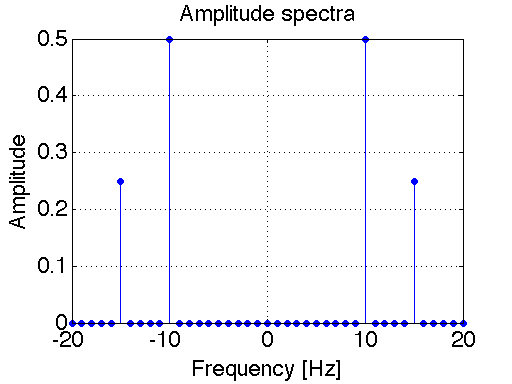
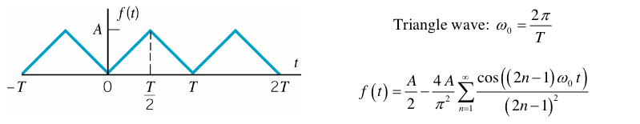

# DSP Lab 1: Working with Signals in MATLAB

**Authors:** Mateo Aboy, Aaron Scher, and Joel Sprunger
*Oregon Institute of Technology*

!!! info "Lab Materials"
    This lab was developed based on coursework for EE 430. It provides hands-on experience with creating, visualizing, and analyzing signals using MATLAB.

## Objectives

The objectives of this lab are to learn how to visualize signals in MATLAB. This requires two tasks:

1. Use the functions in MATLAB to create or import signals
2. Plot the signals as functions of time, with appropriate scales for the x and y axis so that the plot is meaningful and easy to see

## Introduction: Why Study Sinusoids?

Sinusoids are the "building blocks" of all (reasonably well-behaved) signals. By adding enough sinusoids - sometimes an infinite number - with the correct amplitudes, frequencies, and relative phase angles, we can create any signal. Sinusoids are described in mathematics using the cosine function (or sin function) or by complex exponentials $e^{j\theta}$.

In engineering, many systems, such as RLC circuits and small signal amplifiers, can be accurately described as linear time-invariant (LTI) systems. It is straightforward to show that if a sinusoidal signal is input to an LTI system, the output will always be a sinusoid with the same frequency (though, in general, the output will have a different amplitude and phase). This is illustrated in Figure 1 for a cosine function.


**Figure 1:** LTI System - Sinusoid in, Sinusoid out

This means that a 100 Hz sinusoidal signal input to an LTI system will always result in a 100 Hz sinusoid output (zero output would be regarded as a 100 Hz sinusoid with zero amplitude). If a 100 Hz sinusoid input results in a 300 Hz output then the system is not LTI. If a 100 Hz sinusoid input results in a square wave output then the system is not LTI.

!!! success "Why LTI Systems Matter"
    LTI systems are generally much easier to analyze and characterize than nonlinear and time-varying systems. Thus if we can determine how an LTI system will affect sinusoids, we can determine how the system will affect any other signal by first describing the signal as a sum of sinusoids and then determining the effect of the system on the sinusoids separately. This is the motivation for working with sinusoids.

## Spectrum of Periodic and Quasi-Periodic Signals

The **frequency spectrum** of a signal is the frequency content of a signal. Spectral analysis is a widely used and powerful method of data analysis, which determines the spectrum of a time-varying signal.

The spectrum of periodic signals is usually represented as vertical lines, called **line spectra**, whose frequencies and amplitudes are indicated on the x and y axes, respectively. For example, suppose a signal is represented by:

$$x(t) = \cos(2\pi 10t) + 0.5\cos(2\pi 15t)$$

### Single-Sided Spectrum

The frequency spectrum can be plotted either as single-sided or double-sided. In the **single-sided spectrum**, the vertical lines represent the amplitudes of the sinusoids (cosines) that comprise a function.


**Figure 2:** Single-sided spectrum of $x(t) = \cos(2\pi 10t) + 0.5\cos(2\pi 15t)$

### Double-Sided Spectrum

The **double-sided spectrum** is more general than the single-sided spectrum in that it can represent the spectra of both real and complex signals. In the double-sided spectrum, the vertical lines represent the amplitudes of the complex exponentials ($e^{j2\pi f_0t}$) that comprise a function. It results from Euler's Equation, which says that we can decompose a sinusoid into a sum of two complex exponential functions:

$$A\cos(2\pi f_0t) = A\frac{e^{j2\pi f_0t} + e^{-j2\pi f_0t}}{2}$$

Looking at the equation above, we see that the amplitude of the double-sided spectrum for $A\cos(2\pi f_0t)$ is $A/2$ at frequencies $f_0$ and $-f_0$.


**Figure 3:** Double-sided spectrum of $x(t) = \cos(2\pi 10t) + 0.5\cos(2\pi 15t)$

!!! note "Spectrum Comparison"
    The double-sided spectra for a general function $x(t)$ looks just like the single-sided spectra at positive frequencies ($f > 0$). The only difference is that the amplitudes of the double-sided spectrum are one-half as large (i.e. the vertical lines are one-half as long) compared to the single-sided spectrum. If a DC component exists (i.e. a component at $f = 0$) then this spectral component is identical for both single-sided and double-sided spectra.

### Fundamental Frequency

The **fundamental frequency** is the greatest common divisor of all the frequencies present in the signal. The fundamental frequency of the signal given above is 5 Hz, so $x(t)$ will repeat every 1/5 = 0.2 seconds.

**Quasi-Periodic Signals:**

Non-periodic signals can have discrete line spectrum as well. These types of signals are called "quasi-periodic" (or sometimes "non-periodic" or "almost periodic"). If in our previous example we change the 15 Hz component to $\sqrt{8}$ Hz it will never repeat, since $\sqrt{8}$ and 10 do not share a common divisor. However, this signal is still composed of two sinusoids, which are represented as line spectra.

On the other hand, if in our previous example we change the 15 Hz component to 15.21 Hz it will repeat, since 15.21 and 10 share 0.01 as the common divisor. In this case $x(t)$ would repeat every 1/0.01 = 100 seconds.

## Sampling

In this lab we will be creating (simulating) analog signals on a computer using MATLAB. This takes a bit of careful thinking. True analog signals are continuous signals (continuous in both amplitude and time). However, computers deal with **digital signals** that are both discrete in time and amplitude.

Discrete amplitudes aren't usually a problem, since MATLAB can handle large floating point numbers. However the time instances for a signal are not selected automatically in MATLAB. Meaning that if we chose too few points in time to define our signal, it will not be plotted smoothly.

!!! warning "Sampling Rate Selection"
    Soon you will learn that the minimum sampling frequency that you can have for a signal is $2f_{max}$, where $f_{max}$ = the maximum frequency of the signal being sampled. This prevents aliasing. You need not worry about aliasing yet, just remember to select enough time samples for your signal so that the plots appear smooth. For a sinusoid a smooth plot will have a sampling frequency 25 - 100 times the frequency of the signal.

## Example 1: Plotting a Sinusoid

Consider the following sinusoidal signal:

$$x(t) = A\cos(2\pi f_0t + \phi)$$

We will simulate the signal with the following parameters:

- $A = 2$
- $f_0 = 100$ Hz
- $\phi = 0$

### Choice 1: Choose the Time-Span of the Plot

A true sinusoid is everlasting - it started at negative infinity (before the Age of the Dinosaurs) and will continue into the indefinite future forever (long after the Sun consumes the Earth). It is impossible to plot an everlasting signal, so let us choose to plot the sinusoid starting at $t = 0$ and end at 3 periods ($3T$).

This is a reasonable time span for the purposes of visual communication (it is not too "zoomed in" nor too "zoomed out"). Since $f_0 = 100$ Hz, the period $T = 1/f_0 = 0.01$ seconds. Hence we will plot the signal between 0 seconds and 0.03 seconds.

### Choice 2: Choose the Sampling Frequency

As mentioned above, $x(t)$ is a continuous time-waveform. MATLAB cannot plot continuous-time signals directly. Instead it plots the waveform at isolated (discrete) points in time. By default, MATLAB's `plot` function then automatically connects those points with straight lines.

Here we will choose a sampling rate that is 100 times the frequency of the signal: $f_s = (100)(100) = 10000$ Hz. In other words, we choose to plot the sampled continuous-time signal $x(t)$ at equally spaced time instances $T_s = 1/f_s = 0.0001$ seconds. With this choice, our plot will appear to the eye continuous (more-or-less).

```matlab
% Example 1: Plotting a sinusoid
A = 2;           % Amplitude
f0 = 100;        % Frequency (Hz)
phi = 0;         % Phase (radians)
fs = 10000;      % Sampling frequency (Hz)
T = 1/f0;        % Period
t = 0:1/fs:3*T;  % Time vector (3 periods)

% Generate sinusoid
x = A * cos(2*pi*f0*t + phi);

% Plot
figure;
plot(t, x, 'LineWidth', 1.5);
xlabel('Time (s)');
ylabel('Amplitude');
title('Sinusoidal Signal');
grid on;
```


**Figure 4:** Plot of sinusoidal signal

## Example 2: Euler's Identity

In this example we will simulate and plot two signals to demonstrate Euler's equation:

$$e^{j\theta} = \cos(\theta) + j\sin(\theta)$$

We will simulate the signal with the following parameters:

- $\theta = 2\pi f_0t + \phi$
- $f_0 = 3$ Hz
- $\phi = 0$

```matlab
% Example 2: Euler's Identity
f0 = 3;              % Frequency (Hz)
fs = 100;            % Sampling frequency (Hz)
t = 0:1/fs:2;        % Time vector

% Generate signals
theta = 2*pi*f0*t;
complex_exp = exp(1j*theta);
euler_sum = cos(theta) + 1j*sin(theta);

% Plot
figure;
plot(t, real(complex_exp), 'b-', 'LineWidth', 1.5);
hold on;
plot(t, real(euler_sum), 'r.', 'MarkerSize', 8);
plot(t, imag(complex_exp), 'g-', 'LineWidth', 1.5);
plot(t, imag(euler_sum), 'm.', 'MarkerSize', 8);
xlabel('Time (s)');
ylabel('Amplitude');
legend('Real(e^{j\theta})', 'Real(cos+jsin)', ...
       'Imag(e^{j\theta})', 'Imag(cos+jsin)');
title('Euler''s Identity Demonstration');
grid on;
```


**Figure 5:** This plot shows the complex signal $e^{j\theta} = \cos(\theta) + j\sin(\theta)$ with $\theta = 2\pi ft = \omega t$. The complex exponential $e^{j\theta}$ is plotted as solid lines for real and imaginary parts, and $\cos(\theta) + j\sin(\theta)$ as dots for real and imaginary parts. The solid lines and dotted lines overlap exactly, demonstrating the validity of Euler's Identity.

## Example 3: Signals as a Sum of Sinusoids

In this example we demonstrate the linear combination of sinusoids that are present in a square wave. The Fourier Series of a square wave is shown below in Figure 6. Using this Fourier Series, we simulate in MATLAB how adding up various numbers of sinusoids approximates a square wave.


**Figure 6:** Fourier Series of a square wave

### Summing Four Harmonics

```matlab
% Example 3: Square wave approximation
f0 = 1;           % Fundamental frequency (Hz)
fs = 1000;        % Sampling frequency (Hz)
t = 0:1/fs:2;     % Time vector

% Sum first 4 harmonics
x = zeros(size(t));
for n = 1:2:7     % n = 1, 3, 5, 7
    x = x + (4/(n*pi)) * sin(2*pi*n*f0*t);
end

figure;
plot(t, x, 'LineWidth', 1.5);
xlabel('Time (s)');
ylabel('Amplitude');
title('Square Wave Approximation (4 harmonics)');
grid on;
axis([0 2 -1.5 1.5]);
```


**Figure 7:** Summing the first four harmonics of a square wave

### Summing 1000 Harmonics

```matlab
% Sum first 1000 harmonics
x = zeros(size(t));
for n = 1:2:1999  % n = 1, 3, 5, ..., 1999
    x = x + (4/(n*pi)) * sin(2*pi*n*f0*t);
end

figure;
plot(t, x, 'LineWidth', 1.5);
xlabel('Time (s)');
ylabel('Amplitude');
title('Square Wave Approximation (1000 harmonics)');
grid on;
axis([0 2 -1.5 1.5]);
```


**Figure 8:** Summing the first 1000 harmonics of a square wave

!!! note "Gibbs Phenomenon"
    Even with 1000 harmonics, you can see small ripples near the discontinuities. This is called the Gibbs phenomenon and occurs when approximating discontinuous functions with Fourier series.

## Example 4: Using MATLAB's FFT Function to Find the Spectrum

Later in this course we will study the Discrete Fourier Transform (DFT) and Fast Fourier Transform (FFT) in detail. For now, let's take an initial look at how to use MATLAB's `fft` function for spectral analysis.

Consider the sinusoidal signal:

$$x(t) = \cos(2\pi 10t) + 0.5\cos(2\pi 15t)$$

```matlab
% Example 4: FFT spectrum
f1 = 10;          % First frequency (Hz)
f2 = 15;          % Second frequency (Hz)
fs = 1000;        % Sampling frequency (Hz)
T_window = 1.3333; % Time window (s)
t = 0:1/fs:T_window;

% Generate signal
x = cos(2*pi*f1*t) + 0.5*cos(2*pi*f2*t);

% Compute FFT
N = length(x);
X = fft(x);
f = (-N/2:N/2-1)*(fs/N);  % Frequency vector
X_shifted = fftshift(X);   % Shift zero frequency to center

% Plot double-sided magnitude spectrum
figure;
plot(f, abs(X_shifted)/N, 'LineWidth', 1.5);
xlabel('Frequency (Hz)');
ylabel('Magnitude');
title('Double-Sided Spectrum using FFT');
grid on;
xlim([-30 30]);
```


**Figure 9:** Spectrum of $x(t) = \cos(2\pi 10t) + 0.5\cos(2\pi 15t)$ computed with MATLAB's FFT function

!!! info "Windowing Effects"
    Compare the double-sided spectrum shown in Figure 9 with that shown in Figure 3. Qualitatively, they are very similar. The ripples and "signal spread" exhibited in Figure 9 are due to windowing, which we will study more about later in this course. A true sinusoid is everlasting, but with MATLAB we can only simulate a sinusoid that exists for a finite time. Hence the FFT of a sinusoid gives the spectrum of a **truncated** sinusoid (not an ideal everlasting sinusoid). If we increase the time window, the spectra will be "sharper" (approaching that shown in Figure 3).

## Lab Tasks

### Report Guidelines

For the lab report, you will create a PowerPoint presentation (or use a similar presentation program), save it as a PDF, and submit it online according to the instructions given in class. All submitted MATLAB code should be well organized and commented with clear comments for easy readability. All submitted plots should be easy to see and well-labeled.

!!! warning "Independent Work"
    You are to work independently. This is not a team assignment. Feel free to help your fellow classmates understand principles and concepts, but please do not share your work.

Your presentation will have 23 slides. Please include a slide number in the footer of each slide. To earn full credit your presentation must contain the slides in the order asked for in this lab. If you miss a slide, please leave a blank slide in its place so that you still have exactly 23 slides total.

**Slide 1:** Title slide with your name, student ID number, date, lab name, class number/title.

### Task 1: Sinusoids and Euler's Equation

Consider the following continuous time signal:

$$x_1(t) = (1 + \cos(2\pi 20t))\cos(2\pi 100t)$$

**a)** Use Euler's Identity to re-write the previous signal $x_1(t)$ as a new signal $x_2(t)$ that is a sum of three sinusoids. Show your derivation and final result in **Slides 2-3**.

**b)** Plot $x_1(t)$ in blue and $x_2(t)$ in red dots on the same plot to confirm that they are the same. In your plot, choose a sampling frequency of 600 Hz over the time interval $0 \leq t \leq 0.6$ seconds. Present your plot and accompanying MATLAB script in **Slides 4-6**.

**c)** Use the `stem` command in MATLAB to plot the double-sided spectrum of $x_2(t)$. Present your stem plot in **Slide 7**.

**d)** Use the `fft` command in MATLAB to plot the double-sided spectrum of $x_1(t)$. Present your plot in **Slide 8**. Compare your stem plot with your fft plot. They should be similar (in the sense that Figure 9 is similar to Figure 3).

### Task 2: Composing Signals Using Sinusoids

The Fourier Series for a triangle wave is presented in Figure 10 below.


**Figure 10:** Fourier Series of a triangle wave

**a)** Similarly to what we did in creating Figure 7, use the `subplot` function in MATLAB to show the effect of combining the first, second, third, and fourth harmonics individually. These harmonics correspond to index values *n* = 1, 2, 3, and 4 in the series (in Figure 10), respectively. For this problem, choose the fundamental frequency $f_0 = 100$ Hz. Plot over three periods (i.e. plot over the time interval $0 \leq t \leq 3T$ where $T = 1/f_0$). Present your plot and accompanying MATLAB script in **Slides 9-11**.

**b)** Use a for loop to approximate the triangle wave with 1000 harmonics. Present your plot and accompanying MATLAB script in **Slides 12-13**.

### Task 3: Periodic and Quasi-Periodic Signals

Consider the following continuous time signal:

$$x(t) = \cos(2\pi f_1t) + \cos(2\pi f_2t)$$

**a)** If $f_1 = 8$ Hz and $f_2 = 10$ Hz, what is the fundamental frequency $f_0$ of this periodic signal? Present your derivation and answer in **Slide 14**. Plot this function over three periods to prove your answer. Present your plot in **Slide 15**.

**b)** Now change the first frequency component to $f_1 = 5\pi/2$ Hz (however, let's keep $f_2 = 10$ Hz the same as before). This new signal is not periodic since $f_1$ and $f_2$ do not share a common divisor. Plot this new signal over the same time span as in your previous plot. Present your plot in **Slide 16**.

### Task 4: Spectral Analysis

[📥 Download: mystery_tone.mat](assets/dsp-lab1/mystery_tone.mat)

**a)** Download the file `mystery_tone.mat`. This file contains a "mystery tone", which is just a simple sinusoidal tone with an amplitude of 2 and a yet-unknown frequency and time duration. The easiest way to load the file into MATLAB is to download the file to your desktop and then manually drag the file icon into MATLAB's workspace. MATLAB should then load the file. The more "traditional" way of loading the file is by using the `load` command.

**b)** Once the file is loaded into MATLAB, you can see what variables are saved in the .mat file by simply typing `whos` in the MATLAB Workspace. You should see that there is a single variable `y` saved in the file. This variable `y` is an array of numbers - it is the "mystery tone"! Make a simple plot of the signal by entering in the command `plot(y)`. Present your plot in **Slide 17**. Since `plot(y)` does not say anything about the x-axis, the x-axis will simply be a sequence of increasing integers starting from 1 and ending at the integer corresponding to the length of the signal itself.

**c)** The reason why I've been referring to this as the "mystery tone" is that the frequency is unknown. Right now, I have not given you enough information to determine the frequency of the tone. This signal could be a 1 Hz sinusoid or a 100 GHz sinusoid. We just don't know. As of yet, the signal is just a sequence of numbers stored in a computer that looks like a sinusoid when you plot it. The key piece of information missing is the sample rate. So let me tell you the sample rate now: **the sample rate is $f_s = 3$ kHz**.

**d)** Given the sample rate $f_s = 3$ kHz, you are to plot the signal over time (using `plot(t,y)`) and determine the frequency of the tone from this plot (the time between peaks is the period T and the frequency is equal to 1/T). This will involve you creating an array `t`, which contains the discrete points in time at which the signal has been sampled. Present the frequency and accompanying plot and MATLAB script in **Slides 18-20**.

**e)** Use MATLAB's `fft` function to determine the frequency of the tone. How does this answer compare to that determined using the method above? Present your results (including a plot of the FFT and accompanying MATLAB script) in **Slides 21-23**.

## Key Concepts Summary

### Signal Representation

- **Sinusoids** are the fundamental building blocks of signals
- Any signal can be represented as a sum of sinusoids (Fourier series)
- Complex exponentials ($e^{j\theta}$) and sinusoids are related through Euler's identity

### Spectrum Analysis

| Type | Description | Use Case |
|------|-------------|----------|
| **Single-sided** | Shows positive frequencies only | Real-valued signals, easier visualization |
| **Double-sided** | Shows both positive and negative frequencies | Complex signals, more general representation |

### MATLAB Functions

| Function | Purpose | Example |
|----------|---------|---------|
| `plot` | Time domain plotting | `plot(t, x)` |
| `stem` | Discrete spectrum plotting | `stem(f, X)` |
| `fft` | Fast Fourier Transform | `X = fft(x)` |
| `fftshift` | Shift zero frequency to center | `fftshift(X)` |
| `cos`, `sin` | Generate sinusoids | `cos(2*pi*f*t)` |
| `exp` | Generate complex exponentials | `exp(1j*theta)` |

## References

1. J. Sprunger and M. Aboy, *Computer Explorations in DSP Laboratory 1 - Working with Signals in MATLAB*, prepared for EE 430, Oregon Institute of Technology, 2013.
2. Oppenheim & Schafer, *Discrete-Time Signal Processing* (textbook)
3. MATLAB Signal Processing Toolbox Documentation

---

*Lab created January 2016 | Updated for modern context February 2026*
