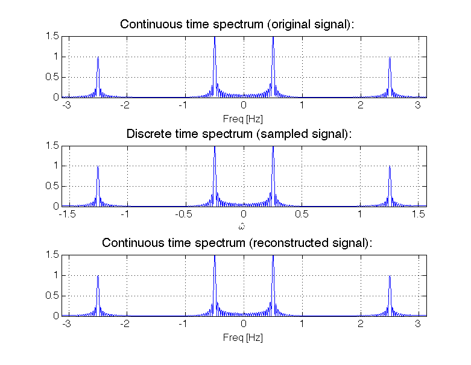
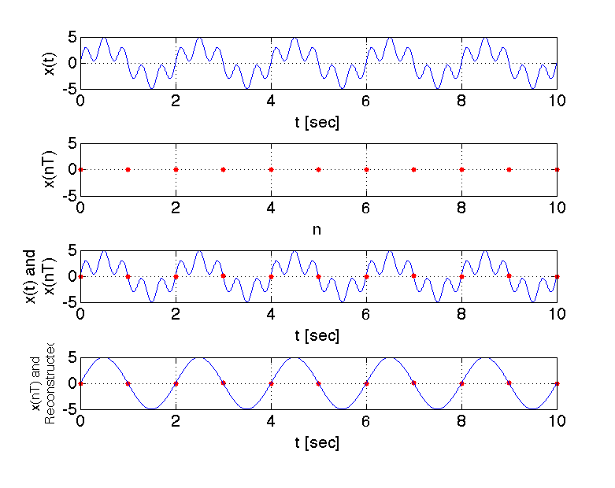

# DSP Lab 2: Sampling and Aliasing

**Authors:** Mateo Aboy, Aaron Scher, and Joel Sprunger
*Oregon Institute of Technology*

!!! info "Lab Materials"
    This lab was developed based on coursework for EE 430. It explores the fundamental concepts of sampling and reconstruction of analog signals, with a focus on understanding and preventing aliasing.

## Objectives

The objective of this lab is to explore the concepts of sampling and reconstruction of analog signals. Specifically, we will:

- Simulate the sampling process of an analog signal using MATLAB
- Investigate the effect of sampling in the time and frequency domains
- Introduce and understand the concept of aliasing
- Apply the Nyquist sampling theorem

## Introduction: Sampling and Aliasing

An **analog-to-digital converter (ADC)** converts an analog signal to a digital form. An ADC produces a stream of binary numbers from analog signals by taking the samples of the analog signal and digitizing the amplitude at these discrete times.

Prior to the ADC conversion, an analog filter called the **prefilter** or **antialiasing filter** is applied to the analog signal in order to deal with an effect known as [aliasing](https://en.wikipedia.org/wiki/Aliasing). Aliasing causes multiple continuous time signals to yield the exact same sampled discrete time signal.

### The Sampling Process

During sampling, an analog signal $x_a(t)$ is periodically measured every $T_s$ seconds:

$$t = nT_s, \quad n = 0, 1, 2, \ldots$$

where $T_s$ is called the **sampling period**, and is the fixed time interval between samples (here we assume a uniform sampling rate that does not change with time). The inverse of $T_s$ is called the **sampling frequency**, that is, the samples per second:

$$f_s = \frac{1}{T_s}$$

When sampling an analog signal we must sample fast enough (i.e. be sure $f_s$ is sufficiently high), so that the samples are a good representation of the original analog signal. If the sampling frequency $f_s$ is not fast enough then too much information is lost, and it becomes impossible to reconstruct our original analog signal using a digital-to-analog converter (DAC). However, if you do sample fast enough, then, theoretically, it is possible to exactly reconstruct the original signal.

### Sampling Theorem (Nyquist-Shannon)

!!! success "Sampling Theorem"
    For accurate representation of signal $x_a(t)$ by its time samples $x[nT]$, two conditions must be met:

    1. The signal $x_a(t)$ must be **bandlimited**, that is, its frequency content (spectrum) must be limited to contain frequencies up to some maximum frequency $f_{max}$ and no frequencies beyond that.

    2. The sampling rate $f_s$ must be chosen to be at least twice the maximum frequency $f_{max}$, that is:

    $$f_s \geq 2f_{max}$$

According to the sampling theorem, before sampling we must make sure the signal is bandlimited (this is the function of the analog prefilter) and that the sampling frequency is at least twice the maximum frequency.

!!! info "Beyond Traditional Nyquist"
    The traditional Nyquist sampling theorem presented above is true for **real-valued** (i.e. not complex), **lowpass** (i.e. baseband) signals.

    - For **complex lowpass** signals, the sampling theorem states that the ultimate minimum sampling rate to avoid aliasing is actually $f_s = B$, where $B$ is the double-sided bandwidth.
    - For **bandpass** signals, things get even more interesting. You can subsample (i.e. sample below the Nyquist rate) to achieve frequency translation to lower frequencies and recover the original signal.

## Example 1: Sampling Higher Than Nyquist Rate

Consider the following continuous time signal:

$$x_a(t) = 3\sin(2\pi 0.5t) + 2\sin(2\pi 2.5t)$$

The signal contains two frequency components at $f_1 = 0.5$ Hz and $f_2 = 2.5$ Hz. The maximum frequency is $f_{max} = 2.5$ Hz.

We explore the effect of aliasing by sampling $x_a(t)$ at $f_s = 2.5f_{max} = 6.25$ Hz. This sampling frequency **meets** the sampling theorem requirement.

### Time Domain Plots

```matlab
% Example 1: Sampling above Nyquist rate
f1 = 0.5;         % First frequency (Hz)
f2 = 2.5;         % Second frequency (Hz)
fmax = 2.5;       % Maximum frequency (Hz)
fs = 2.5 * fmax;  % Sampling frequency = 6.25 Hz

% Create continuous time signal (for visualization)
t_cont = 0:0.001:10;  % Fine time resolution
xa = 3*sin(2*pi*f1*t_cont) + 2*sin(2*pi*f2*t_cont);

% Sample the signal
Ts = 1/fs;
n = 0:floor(10/Ts);
t_samp = n * Ts;
x_samp = 3*sin(2*pi*f1*t_samp) + 2*sin(2*pi*f2*t_samp);

% Reconstruct signal (ideal reconstruction)
x_recon = x_samp;  % For ideal reconstruction
t_recon = t_samp;

% Plot
figure;
subplot(3,1,1);
plot(t_cont, xa, 'LineWidth', 1.5);
xlabel('Time (s)'); ylabel('Amplitude');
title('Original Continuous Signal x_a(t)');
grid on;

subplot(3,1,2);
stem(t_samp, x_samp, 'filled');
xlabel('Time (s)'); ylabel('Amplitude');
title(['Sampled Signal x[n], f_s = ', num2str(fs), ' Hz']);
grid on;

subplot(3,1,3);
plot(t_cont, xa, 'b-', 'LineWidth', 1);
hold on;
stem(t_samp, x_samp, 'r', 'filled');
xlabel('Time (s)'); ylabel('Amplitude');
title('Sampled Signal Superimposed on Reconstructed Signal');
legend('Reconstructed', 'Samples');
grid on;
```


**Figure 1:** First plot shows the original continuous time signal $x_a(t)$. Second plot shows the sampled discrete time signal $x[n]$ with $f_s = 2.5f_{max} = 6.25$ Hz. Third plot shows the sampled discrete time signal superimposed on top of the reconstructed time-domain signal.

### Frequency Domain Plots

```matlab
% Compute FFT of signals
N = 2048;  % FFT length
freq = (-N/2:N/2-1)*(fs/N);

% FFT of original signal (using high sampling rate)
fs_high = 1000;  % High sampling for "continuous" approximation
t_high = 0:1/fs_high:10;
xa_high = 3*sin(2*pi*f1*t_high) + 2*sin(2*pi*f2*t_high);
Xa = fftshift(fft(xa_high, N));

% FFT of sampled signal
Xs = fftshift(fft(x_samp, N));

% Plot spectra
figure;
subplot(3,1,1);
plot(freq, abs(Xa)/max(abs(Xa)), 'LineWidth', 1.5);
xlabel('Frequency (Hz)'); ylabel('Normalized Magnitude');
title('Spectrum of Original Signal');
grid on; xlim([-10 10]);

subplot(3,1,2);
plot(freq, abs(Xs)/max(abs(Xs)), 'LineWidth', 1.5);
xlabel('Frequency (Hz)'); ylabel('Normalized Magnitude');
title(['Spectrum of Sampled Signal, f_s = ', num2str(fs), ' Hz']);
grid on; xlim([-10 10]);

subplot(3,1,3);
plot(freq, abs(Xa)/max(abs(Xa)), 'LineWidth', 1.5);
xlabel('Frequency (Hz)'); ylabel('Normalized Magnitude');
title('Spectrum of Reconstructed Signal');
grid on; xlim([-10 10]);
```


**Figure 2:** First plot shows the two-sided amplitude spectrum of the original time signal. Second plot shows the two-sided amplitude spectrum of the sampled discrete time signal with $f_s = 2.5f_{max} = 6.25$ Hz. Third plot shows the two-sided amplitude spectrum of the reconstructed time-domain signal.

!!! success "Perfect Reconstruction"
    Note that the reconstructed time-domain signal is equal to the original time-domain signal, because the sampling theorem is met.

## Example 2: Sampling Lower Than Nyquist Rate

Consider the same continuous time signal as in Example 1:

$$x_a(t) = 3\sin(2\pi 0.5t) + 2\sin(2\pi 2.5t)$$

The signal contains two frequency components at $f_1 = 0.5$ Hz and $f_2 = 2.5$ Hz. We explore the effect of aliasing by sampling $x_a(t)$ at $f_s = 1$ Hz. This sampling frequency **does not meet** the sampling theorem requirement ($f_s < 2f_{max}$).

```matlab
% Example 2: Sampling below Nyquist rate (undersampling)
fs_under = 1;  % Sampling frequency = 1 Hz (violates Nyquist!)

% Sample the signal
Ts_under = 1/fs_under;
n_under = 0:floor(10/Ts_under);
t_under = n_under * Ts_under;
x_under = 3*sin(2*pi*f1*t_under) + 2*sin(2*pi*f2*t_under);

% What we actually reconstruct (aliased version)
% The 2.5 Hz component aliases to 0.5 Hz!
x_recon_aliased = 3*sin(2*pi*0.5*t_cont) + 2*sin(2*pi*0.5*t_cont);
x_recon_aliased = 5*sin(2*pi*0.5*t_cont);

% Plot
figure;
subplot(4,1,1);
plot(t_cont, xa, 'LineWidth', 1.5);
title('Original Signal x_a(t)');
xlabel('Time (s)'); ylabel('Amplitude');
grid on;

subplot(4,1,2);
stem(t_under, x_under, 'filled');
title(['Sampled Signal x[n], f_s = ', num2str(fs_under), ' Hz']);
xlabel('Time (s)'); ylabel('Amplitude');
grid on;

subplot(4,1,3);
plot(t_cont, xa, 'b-', 'LineWidth', 1);
hold on;
stem(t_under, x_under, 'r', 'filled');
title('Sampled Signal on Original Signal');
xlabel('Time (s)'); ylabel('Amplitude');
legend('Original', 'Samples');
grid on;

subplot(4,1,4);
plot(t_cont, x_recon_aliased, 'g-', 'LineWidth', 1.5);
hold on;
stem(t_under, x_under, 'r', 'filled');
title('Sampled Signal on Reconstructed Signal (Aliased!)');
xlabel('Time (s)'); ylabel('Amplitude');
legend('Reconstructed (Wrong!)', 'Samples');
grid on;
```


**Figure 3:** First plot shows the original continuous time signal $x_a(t)$. Second plot shows the sampled discrete time signal $x[n]$ with $f_s = f_{max}/2.5 = 1$ Hz. Third plot shows the sampled discrete time signal superimposed on top of the original time-domain signal. Fourth plot shows the sampled discrete time signal superimposed on top of the reconstructed time-domain signal.

### Aliasing Effect

Note that the reconstructed time-domain signal is **not equal** to the original time-domain signal, because the sampling theorem is not met. The reconstructed signal is:

$$x_r(t) = 3\sin(2\pi 0.5t) + 2\sin(2\pi 0.5t) = 5\sin(2\pi 0.5t)$$

The above equation results because a 0.5 Hz sinusoid is an **alias** of a 2.5 Hz sinusoid.

!!! danger "Aliasing Explained"
    When sampling at $f_s = 1$ Hz, the 2.5 Hz component appears as a 0.5 Hz component in the sampled signal. This is because:

    $$2.5 \mod 1 = 0.5$$

    The high-frequency component "wraps around" and masquerades as a low-frequency component. This is **aliasing** - different continuous-time signals produce identical discrete-time sequences.


**Figure 4:** Frequency domain plots showing aliasing. The spectrum of the sampled signal shows how the 2.5 Hz component has aliased to 0.5 Hz.

## Lab Tasks

### Report Guidelines

For the lab report, you will create a PowerPoint presentation (or use a similar presentation program), save it as a PDF, and submit it online according to the instructions given in class. All submitted MATLAB code should be well organized and commented with clear comments for easy readability. All submitted plots should be easy to see and well-labeled.

!!! warning "Independent Work"
    You are to work independently. This is not a team assignment. Feel free to help your fellow classmates understand principles and concepts, but please do not share your work.

!!! tip "Subplot Formatting"
    This lab involves generating many plots using MATLAB's `subplot` function. This will likely result in figures which are "squashed" together. To unsquash the images, please manually stretch (resize) the figure window before placing the figures in your presentation.

Your presentation will have 11 slides. Please include a slide number in the footer of each slide. To earn full credit your presentation must contain the slides in the order asked for in this lab. If you miss a slide, please leave a blank slide in its place so that you still have exactly 11 slides total.

**Slide 1:** Title slide with your name, student ID number, date, lab name, class number/title.

### Task 1: Sampling Higher Than Nyquist Rate

Consider a continuous time domain signal:

$$x_a(t) = 2\cos(2\pi 0.5t) + \sin(2\pi 1.5t) + \cos(2\pi 2.5t) + 1.5\cos(2\pi 3.5t)$$

**a)** Suppose we sample $x_a(t)$ with a sampling frequency $f_s = 10f_{max}$. Create a 3-by-1 plot like Example 1 where you plot the original continuous time signal $x_a(t)$, the sampled discrete time signal $x[n]$, and the sampled discrete time signal superimposed over the reconstructed signal. Present your plot and your MATLAB code in **Slides 2-5**. Please program MATLAB to display your name as the title of the plot (e.g. The MATLAB command would be something like: `title('Jane Doe')`).

### Task 2: Sampling Lower Than Nyquist Rate

**a)** Consider the continuous time signal $x_a(t)$ expressed in the equation above (Task 1). Suppose we sample $x_a(t)$ with a sampling frequency $f_s = f_{max}$. Create a 4-by-1 plot like Example 2 where you plot the original continuous time signal $x_a(t)$, the sampled discrete time signal $x[n]$, the sampled discrete time signal superimposed over the original continuous time signal, and the sampled discrete time signal superimposed over the reconstructed signal. Present your plot in **Slide 6**. Please program MATLAB to display your name as the title of the plot.

### Task 3: Anti-Aliasing Filter

**a)** Consider the continuous time signal $x_a(t)$ from Task 1. Consider again a sampling frequency $f_s = f_{max}$. Suppose you first process $x_a(t)$ with an ideal anti-aliasing low-pass prefilter and then sample the signal. What is the signal after the anti-aliasing low-pass prefilter? Present your expression in **Slide 7**.

Create a 4-by-1 plot where you plot:
1. The original continuous time signal $x_a(t)$
2. The continuous time signal after it has been processed by the prefilter
3. The sampled discrete time signal $x[n]$
4. The sampled discrete time signal superimposed over the reconstructed signal

Present your plot in **Slide 8**. Please program MATLAB to display your name as the title of the plot.

!!! info "Anti-Aliasing Filter Design"
    An ideal anti-aliasing filter is a low-pass filter with cutoff frequency $f_c = f_s/2$. It removes all frequency components above the Nyquist frequency before sampling.

### Task 4: The Atari (Wrap-Around) Effect

#### Part A: Complex Signal Aliasing

Consider a continuous time domain **complex** signal:

$$x_a(t) = e^{j2\pi 10t}$$

Create a 4-by-1 plot where you plot the double-sided spectrum of the sampled signal for the following sampling frequencies: $f_s = 25$ Hz, $f_s = 21$ Hz, $f_s = 19$ Hz, $f_s = 15$ Hz.

Present your plot in **Slide 9**. Please program MATLAB to display your name as the title of the plot. When creating your signal, sample your signal for a total of 10 seconds or more (this large sampling window will result in "sharp" spectral peaks). For your plot make sure to set `axis tight`.

```matlab
% Complex signal aliasing example
f0 = 10;          % Signal frequency (Hz)
T_window = 10;    % Long window for sharp peaks

fs_values = [25, 21, 19, 15];  % Different sampling rates

figure;
for i = 1:4
    fs = fs_values(i);
    t = 0:1/fs:T_window;
    x = exp(1j*2*pi*f0*t);

    % Compute FFT
    N = length(x);
    X = fftshift(fft(x));
    f = (-N/2:N/2-1)*(fs/N);

    subplot(4,1,i);
    plot(f, abs(X), 'LineWidth', 1.5);
    xlabel('Frequency (Hz)');
    ylabel('Magnitude');
    title(['f_s = ', num2str(fs), ' Hz']);
    grid on;
    axis tight;
end
```

#### Part B: Real Signal Aliasing

Consider a continuous time domain signal:

$$x_a(t) = \cos(2\pi 10t)$$

Create a 4-by-1 plot where you plot the double-sided spectrum of the sampled signal for the following sampling frequencies: $f_s = 25$ Hz, $f_s = 21$ Hz, $f_s = 19$ Hz, $f_s = 15$ Hz.

Present your plot in **Slide 10**. Please program MATLAB to display your name as the title of the plot. When creating your signal, sample your signal for a total of 10 seconds or more. For your plot make sure to set `axis tight`.

#### Part C: Explanation

In **Slide 11** explain what is meant by the **Atari (wrap-around) effect** in terms of sampling and aliasing.

!!! question "The Atari Effect"
    The "Atari effect" or "wagon wheel effect" is a visual manifestation of aliasing. When a rotating object is sampled (filmed) at a rate close to its rotation frequency, it can appear to rotate slowly backwards, stand still, or rotate at the wrong speed. This is because the sampling rate is too low relative to the motion, causing aliasing in the temporal domain.

    In the frequency domain, when the sampling rate is below Nyquist, high-frequency components "wrap around" the Nyquist frequency and appear as low-frequency components in the sampled signal.

## Key Concepts Summary

### Sampling Theorem

| Condition | Requirement | Effect if Violated |
|-----------|-------------|-------------------|
| **Bandlimited signal** | $f_{max}$ must be finite | Cannot sample properly |
| **Nyquist rate** | $f_s \geq 2f_{max}$ | Aliasing occurs |
| **Reconstruction** | Ideal low-pass filter | Perfect recovery (if Nyquist met) |

### Aliasing Formula

For a sinusoid at frequency $f_0$ sampled at rate $f_s$, the aliased frequency is:

$$f_{alias} = |f_0 - k \cdot f_s|$$

where $k$ is chosen such that $0 \leq f_{alias} < f_s/2$.

### MATLAB Functions for Sampling

| Function | Purpose | Example |
|----------|---------|---------|
| `stem` | Plot discrete samples | `stem(n, x)` |
| `fft` | Frequency analysis | `X = fft(x)` |
| `fftshift` | Center zero frequency | `fftshift(X)` |
| `resample` | Change sampling rate | `y = resample(x, p, q)` |
| `decimate` | Downsample with filtering | `y = decimate(x, r)` |

### Prevention Strategies

!!! success "Preventing Aliasing"
    1. **Analog anti-aliasing filter**: Apply low-pass filter before ADC
    2. **Oversample**: Sample at $f_s \gg 2f_{max}$ (typically 5-10× Nyquist rate)
    3. **Bandlimit the signal**: Remove high-frequency components before sampling
    4. **Use appropriate ADC**: Select ADC with sufficient sampling rate

## Downloadable Resources

- [📥 Complex Signals and Radios (PDF)](assets/dsp-lab2/Complex-Signals-and-Radios-short-2pp.pdf)

## References

1. J. Sprunger and M. Aboy, *Computer Explorations in DSP Laboratory 2 - Signals and Aliasing*, prepared for EE 430, Oregon Institute of Technology, 2013.
2. M. Valkama, *Complex valued signals and systems - Basic principles and applications to radio communications and radio signal processing*, Tampere University of Technology.
3. Oppenheim & Schafer, *Discrete-Time Signal Processing* (textbook)
4. MATLAB Signal Processing Toolbox Documentation

---

*Lab created January 2016 | Updated for modern context February 2026*
