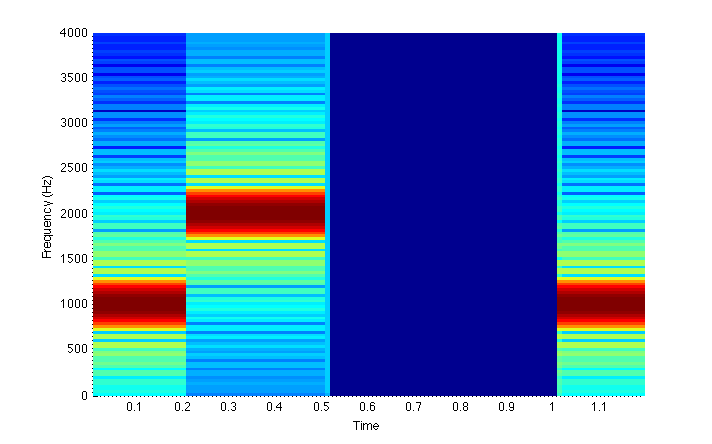

# DSP Lab 4: DTMF Tone and Song Generator

**Author:** Dr. Aaron Scher
*Oregon Institute of Technology*

!!! info "Lab Materials"
    This lab explores Dual-Tone Multi-Frequency (DTMF) signaling and provides hands-on experience with tone generation, audio synthesis, and frequency analysis using MATLAB.

## Objectives

The objective of this lab is to investigate DTMF tone generation by:

- Understanding how telephone keypads encode digits as audio tones
- Creating MATLAB functions to generate DTMF signals
- Composing musical sequences using DTMF tones
- Analyzing signals using spectrograms
- Exploring the effects of different sampling rates

## Introduction

When you press a number on the key pad of a standard telephone, you generate a pair of audible tones, each with a different frequency. If your phone is connected to a phone line, then these tones let the phone company know what number you are pressing. As long as the telephone company can identify the two tones, it can identify the digits of the desired telephone number.


### DTMF Frequency Table

A table that summarizes the tones associated with each button on a touch tone phone is shown below. This communication signaling is called **Dual Tone Multi-Frequency (DTMF)** signaling.


!!! note "DTMF Encoding"
    Each key on the telephone keypad is represented by two simultaneous sine waves:

    - One from the **row frequency** (697, 770, 852, or 941 Hz)
    - One from the **column frequency** (1209, 1336, 1477, or 1633 Hz)

    For example, pressing "5" generates a tone consisting of 770 Hz + 1336 Hz.

Note that the last column is not used on a typical touch-tone phone (digits A, B, C, and D), but can be used for data transmission.

## Lab Instructions

You are to generate an m-file called `song.m`. When this file is executed it should play a song by playing a sequence of DTMF tones in order.

### Example: "Mary Had a Little Lamb"

As an example, the song "Mary Had a Little Lamb" is generated by playing the following sequence of tones in order:

**4, 5, 6, 5, 6, 6, 6, 5, 5, 5, 6, 6, 6, 4, 5, 6, 5, 6, 6, 6, 4, 5, 5, 6, 5, 4**

In the case of "Mary Had a Little Lamb", to sound correctly I've found that each number should have a duration of about 0.1 seconds, and there should be a space (silence) between each number of about 0.05 seconds. Of course, these values can be changed to suit one's musical tastes.

## MATLAB Requirements

### 1. Song Requirements

- Your song must have **at least 20 numbers**
- Your song must **not last longer than 1 minute**
- Use a sampling frequency of $f_s = 8000$ Hz

### 2. Create `generateDTMF` Function

To generate a clean code, you must create and incorporate a function called `generateDTMF` that will create a DTMF tone. The inputs to the function are the digit, sampling frequency, and duration of the tone:

```matlab
x = generateDTMF(digit, duration, fs)
```

**Input parameters:**

- `digit`: An integer corresponding to the DTMF tone (0-9, or 10='*', 11='#')
- `duration`: The time duration of the DTMF tone (in seconds)
- `fs`: The sampling frequency (Hz)

**Output:**

- `x`: The DTMF signal (array of samples)

**Example implementation:**

```matlab
function x = generateDTMF(digit, duration, fs)
    % DTMF frequency table
    % Rows: 1=697, 2=770, 3=852, 4=941 Hz
    % Cols: 1=1209, 2=1336, 3=1477, 4=1633 Hz

    row_freqs = [697, 770, 852, 941];
    col_freqs = [1209, 1336, 1477, 1633];

    % Map digits to row and column
    keypad = [1, 2, 3, 10;    % 1, 2, 3, A
              4, 5, 6, 11;    % 4, 5, 6, B
              7, 8, 9, 12;    % 7, 8, 9, C
              13, 0, 14, 15]; % *, 0, #, D

    % Find row and column for this digit
    [row, col] = find(keypad == digit);

    if isempty(row)
        error('Invalid digit: %d', digit);
    end

    % Get frequencies
    f_row = row_freqs(row);
    f_col = col_freqs(col);

    % Generate time vector
    t = 0:1/fs:duration;

    % Generate DTMF tone (sum of two sinusoids)
    x = sin(2*pi*f_row*t) + sin(2*pi*f_col*t);
end
```

### 3. Create `generateSilence` Function

Create a second function called `generateSilence` similar to `generateDTMF` for creating the silent parts of the composition:

```matlab
x = generateSilence(duration, fs)
```

**Example implementation:**

```matlab
function x = generateSilence(duration, fs)
    % Generate silence (zeros) for specified duration
    num_samples = round(duration * fs);
    x = zeros(1, num_samples);
end
```

### 4. Code Organization

- Label and include clear comments in your code for maximum readability
- Your entire musical composition should be saved as one long array `s`
- Use array concatenation to merge signals together

**Example of merging arrays:**

```matlab
% Generate individual tones
tone1 = generateDTMF(4, 0.1, 8000);
silence1 = generateSilence(0.05, 8000);
tone2 = generateDTMF(5, 0.1, 8000);

% Combine into single array
s = [tone1, silence1, tone2];
```

### 5. Generate Spectrograms

Generate and display a spectrogram of the song using the MATLAB command `spectrogram` (this will be figure 1):

```matlab
% Spectrogram parameters
fs = 8000;           % Sampling frequency
res_time = 0.01;     % Time resolution (seconds)

% Generate spectrogram
% The spectrogram function works by taking an FFT of the signal
% over small "chunks" of time (equal to res_time) and then
% displays all the data on a time versus frequency axis.

figure;
spectrogram(s, blackman(fs*res_time), 0, [], fs, 'yaxis');
title('Song Spectrogram (fs = 8000 Hz)');
colorbar;
```


**Figure 1:** Example spectrogram showing DTMF tones over time

!!! info "Understanding Spectrograms"
    A spectrogram displays how the frequency content of a signal changes over time. For DTMF signals, you should see:

    - Horizontal bands at the DTMF frequencies (697-1633 Hz)
    - Each digit appears as two horizontal lines (row + column frequencies)
    - Gaps between tones appear as blank (silent) regions

    Great resources:
    - [StackOverflow: MATLAB Spectrogram Parameters](http://stackoverflow.com/questions/5887366/matlab-spectrogram-params)
    - Textbook Chapter 13

### 6. Demonstrate Your Song

You must demonstrate your song to me in class using the MATLAB command `soundsc` at the date specified in the Blackboard shell:

```matlab
% Play the song
soundsc(s, fs);
```

!!! warning "Volume Warning"
    Before playing, turn down your speaker/headphone volume to a comfortable level!

### 7. Test Different Sampling Rates

Once everything works, change the sampling frequency and observe the effects:

**Test 1: $f_s = 4000$ Hz**

```matlab
% Regenerate song at fs = 4000 Hz
fs_new = 4000;
% ... regenerate all tones with new fs ...

% Listen to the song
soundsc(s_4000, fs_new);

% Generate spectrogram (Figure 2)
figure;
spectrogram(s_4000, blackman(fs_new*res_time), 0, [], fs_new, 'yaxis');
title('Song Spectrogram (fs = 4000 Hz)');
```

**Test 2: $f_s = 1000$ Hz**

```matlab
% Regenerate song at fs = 1000 Hz
fs_new = 1000;
% ... regenerate all tones with new fs ...

% Listen to the song
soundsc(s_1000, fs_new);

% Generate spectrogram (Figure 3)
figure;
spectrogram(s_1000, blackman(fs_new*res_time), 0, [], fs_new, 'yaxis');
title('Song Spectrogram (fs = 1000 Hz)');
```

!!! question "Analysis Questions"
    In your code comments, answer these questions:

    - Does the song sound different for $f_s = 4000$ Hz and $f_s = 1000$ Hz?
    - Comment on **why** the song does or does not sound different for the two lower sampling rates
    - Think about the **Nyquist frequency**: What is the maximum frequency in a DTMF signal? Is it adequately sampled at these rates?

    **Hint:** The maximum DTMF frequency is 1633 Hz. According to Nyquist, you need $f_s \geq 2 \times 1633 = 3266$ Hz to avoid aliasing.

## What to Turn In

### Deliverables

1. Save all your work in a single m-file called `song.m` and publish it as a single PDF to upload to Blackboard
2. Make sure the functions `generateDTMF` and `generateSilence` are both **local to the file** `song.m`
3. To do this, you will need to turn your script into a function that takes no argument (see Appendix below)
4. Submit your published PDF before the due date
5. If you write any other functions, include those as well in your main m-file

### Demonstration

To earn full credit, you must **demonstrate your song** at the time and date specified on Blackboard.

## Example Code

The following MATLAB code plays a tone with frequency 1000 Hz for 0.2 seconds, then plays a tone with frequency 2000 Hz for 0.3 seconds, then plays nothing (silence) for 0.5 seconds, then plays a tone with frequency 1000 Hz for 0.2 seconds. The sampling frequency is $f_s = 8000$ Hz. The spectrogram of the signal is then displayed.

```matlab
clc; clear all; clf;

fs = 8000;  % Sampling frequency

% Generate first tone (1000 Hz, 0.2 seconds)
t1 = 0:1/fs:0.2;
x1 = cos(t1*2*pi*1000);

% Generate second tone (2000 Hz, 0.3 seconds)
t2 = 0:1/fs:0.3;
x2 = cos(t2*2*pi*2000);

% Generate silence (0.5 seconds)
t3 = 0:1/fs:0.5;
x3 = t3*0;

% Generate third tone (1000 Hz, 0.2 seconds)
t4 = 0:1/fs:0.2;
x4 = cos(t1*2*pi*1000);

% Combine arrays into one signal
s = [x1, x2, x3, x4];

% Play the signal through speakers
soundsc(s, fs);

% Spectrogram parameters
res_time = 0.01;  % Time resolution of spectrogram

% Display spectrogram
spectrogram(s, blackman(fs*res_time), 0, [], fs, 'yaxis');
```

## Appendix: How to Include a Script and Function in the Same File

First, if you are unsure of the differences between a script and a function in MATLAB, you can read more about it here:

- [MATLAB: Scripts and Functions](http://www.mathworks.com/help/matlab/matlab_prog/scripts-and-functions.html)
- [StackOverflow: Script vs Function](http://stackoverflow.com/questions/1695365/whats-the-difference-between-a-script-and-a-function-in-matlab)

For this lab, you will be writing a MATLAB script (`song.m`) as well as MATLAB functions. Normally, each function is saved as a separate m-file that you call from the script. In terms of uploading your assignment to Blackboard, however, it would be very cumbersome to upload all of your separate functions individually.

I would like you to turn in only one published m-file. Unfortunately, MATLAB will not allow you to nest functions inside scripts locally. To get around this limitation we will exploit the fact that you can put functions inside other functions.

**The fix:** Turn your script into a function that takes no argument. In order to do this, you add one line of code to the top of your original script. This one line of code is a function call with the name of your file, but no argument, as illustrated below for m-file named `my_file.m`:

```matlab
function my_file
    % Script here...
    a = 1;
    b = 2;
    the_sum = add_em_up(a, b);  % Custom function
end

function out = add_em_up(x1, x2)
    % Function here...
    out = x1 + x2;
end
```

**Output:**
```
the_sum =
     3
```

With this small fix you can now run and publish the above file (`my_file.m`) as you would a normal script file.

### Complete Example Structure

```matlab
function song
    % SONG - Generate and play a DTMF song
    % This function generates a musical composition using DTMF tones

    clc; clear;

    % Parameters
    fs = 8000;              % Sampling frequency (Hz)
    tone_duration = 0.1;    % Duration of each tone (seconds)
    silence_duration = 0.05; % Duration of silence between tones (seconds)

    % Song sequence (example: Mary Had a Little Lamb)
    notes = [4, 5, 6, 5, 6, 6, 6, 5, 5, 5, 6, 6, 6, ...
             4, 5, 6, 5, 6, 6, 6, 4, 5, 5, 6, 5, 4];

    % Generate song
    s = [];
    for i = 1:length(notes)
        tone = generateDTMF(notes(i), tone_duration, fs);
        silence = generateSilence(silence_duration, fs);
        s = [s, tone, silence];
    end

    % Play song
    soundsc(s, fs);

    % Display spectrogram
    res_time = 0.01;
    figure;
    spectrogram(s, blackman(fs*res_time), 0, [], fs, 'yaxis');
    title('My Song Spectrogram');
    colorbar;
end

function x = generateDTMF(digit, duration, fs)
    % GENERATEDTMF - Generate a DTMF tone
    % Inputs:
    %   digit    - Digit to generate (0-9)
    %   duration - Duration in seconds
    %   fs       - Sampling frequency (Hz)
    % Output:
    %   x        - DTMF signal

    % Your implementation here...
end

function x = generateSilence(duration, fs)
    % GENERATESILENCE - Generate silence
    % Inputs:
    %   duration - Duration in seconds
    %   fs       - Sampling frequency (Hz)
    % Output:
    %   x        - Silent signal (zeros)

    % Your implementation here...
end
```

## Key Concepts Summary

### DTMF Frequencies

| Row | Frequency (Hz) | Columns →    | 1209 Hz | 1336 Hz | 1477 Hz | 1633 Hz |
|-----|----------------|--------------|---------|---------|---------|---------|
| 1   | 697            | **Digits →** | 1       | 2       | 3       | A       |
| 2   | 770            | **Digits →** | 4       | 5       | 6       | B       |
| 3   | 852            | **Digits →** | 7       | 8       | 9       | C       |
| 4   | 941            | **Digits →** | *       | 0       | #       | D       |

### MATLAB Functions

| Function | Purpose | Example |
|----------|---------|---------|
| `sin` | Generate sinusoid | `sin(2*pi*f*t)` |
| `soundsc` | Play audio | `soundsc(x, fs)` |
| `spectrogram` | Time-frequency analysis | `spectrogram(x, window, ...)` |
| `blackman` | Window function | `blackman(N)` |

### Signal Generation Formula

For digit with row frequency $f_r$ and column frequency $f_c$:

$$x(t) = \sin(2\pi f_r t) + \sin(2\pi f_c t)$$

## Creative Ideas

!!! tip "Song Suggestions"
    Here are some simple songs you could try (with note numbers):

    - **Happy Birthday**: 1-1-2-1-4-3, 1-1-2-1-5-4...
    - **Twinkle Twinkle**: 1-1-5-5-6-6-5...
    - **Jingle Bells**: 3-3-3, 3-3-3, 3-5-1-2-3...
    - **Your own composition!**

## References

1. MATLAB Signal Processing Toolbox Documentation
2. DTMF specification: ITU-T Recommendation Q.23
3. Oppenheim & Schafer, *Discrete-Time Signal Processing* (textbook)

---

*Lab created February 2016 | Updated for modern context February 2026*
