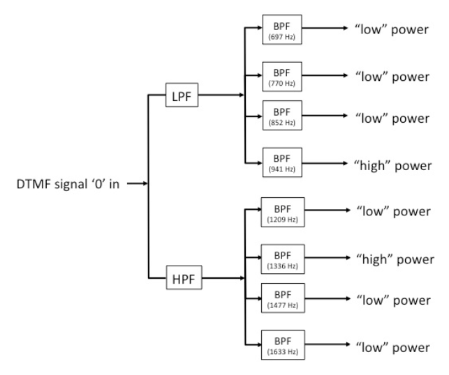
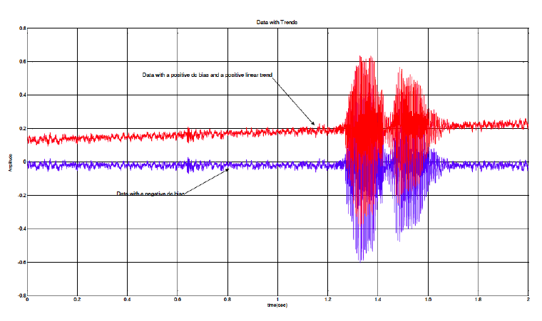

# DSP Lab 5: DTMF Tone Sequence Detector

**Author:** Dr. Aaron Scher
*Oregon Institute of Technology*

!!! info "Lab Materials"
    This lab is a continuation of [DSP Lab 4: DTMF Tone and Song Generator](dsp-lab4-dtmf-generator.md). It provides hands-on experience with designing a DSP system in MATLAB to detect and decode DTMF tone sequences.

## Objectives

The objective of this lab is to design a DSP system in MATLAB that correctly detects the first two tones of a DTMF sequence.

{ width="30%" }
{ width="30%" }

## Instructions

In this lab you will write a MATLAB function called `decodeDTMF`, which will decode the first two tones of a DTMF sequence. The input to this function is a DTMF signal which may contain one to several tones of different time durations. The signal may be noisy. The signal may have periods of silence before and/or after the tones. The function `decodeDTMF` you are to create is specified as follows:

```matlab
first_two_digits = decodeDTMF(file_path)
```

Here `file_path` is the file path to the input signal. The output of this function `first_two_digits` is an array of two integers containing the first two decoded DTMF digits in the order they appear.

### Important Considerations and Assumptions

- If the input signal contains just one DTMF digit then the function should display a single integer that is the decoded DTMF digit.
- If the input signal contains no digits (just noise) or the input sample frequency `fs` is zero or negative, then the function should display an appropriate error message.
- Assume each individual DTMF digit is between 0.3 to 3 seconds in duration.
- Assume the silence between digits is between 0.1 to 3 seconds in duration.
- Assume the signal begins with a period of silence that is at least 0.1 seconds in duration.
- Assume the signal can contain at most five digits.
- Assume the signal level is much higher than the noise (high SNR), as exhibited in the example files below.
- Assume the signal only contains numerical DTMF digits (0-9). It will not contain special characters like * and #.

## Decoding DTMF Tones

To assist you, below is a list of four files containing known DTMF tones. Download these files and use them to test and develop your function.

| File link | Actual DTMF digits | Expected output of `decodeDTMF` |
|-----------|--------------------|---------------------------------|
| [📥 File_Test_1.wav](assets/dsp-lab5/File_Test_1.wav) | 2, 7 | 2, 7 |
| [📥 File_Test_2.wav](assets/dsp-lab5/File_Test_2.wav) | 4, 0, 7, 8 | 4, 0 |
| [📥 File_Test_3.wav](assets/dsp-lab5/File_Test_3.wav) | 9 | 9 |
| [📥 File_Test_4.wav](assets/dsp-lab5/File_Test_4.wav) | (noise) | Error: "No signal detected!" |

## What to Turn In

You will be submitting the following deliverables:

1. A PDF containing the completed table below (see grading files)
2. Your function `decodeDTMF` published and saved as a PDF. Your MATLAB code should be clear, logical, organized, and well-commented for ease of reading. Be sure all other functions you write for this assignment are local to this function. You should only publish one m-file.

### In-Class Demonstration

To earn full credit, I will randomly choose one of the DTMF tone files below for you to demonstrate that your function correctly decodes the file and returns the proper decoded values. The date for this in-class demonstration is posted to Blackboard.

### Grading Files

Complete the table below by running your `decodeDTMF` function on each file:

| File link | Output of `decodeDTMF` |
|-----------|------------------------|
| [📥 File01.wav](assets/dsp-lab5/File01.wav) | |
| [📥 File02.wav](assets/dsp-lab5/File02.wav) | |
| [📥 File03.wav](assets/dsp-lab5/File03.wav) | |
| [📥 File04.wav](assets/dsp-lab5/File04.wav) | |
| [📥 File05.wav](assets/dsp-lab5/File05.wav) | |
| [📥 File06.wav](assets/dsp-lab5/File06.wav) | |
| [📥 File07.wav](assets/dsp-lab5/File07.wav) | |
| [📥 File08.wav](assets/dsp-lab5/File08.wav) | |

## Hints and Tips

**1. Filter Bank Approach**

An effective way for determining a tone is to create a bank of filters as shown below. In this figure, as an example, it shows a "0" signal entering the filter bank. Note that the bandpass filters (BPFs) associated with the 941 Hz and 1336 Hz tones provide the largest outputs.

{ width="50%" }

**2. Finding Signal Start**

The DTMF signal will usually begin and end with a period of silence. In addition, each DTMF digit in the sequence is separated by silences. So use silence to your advantage. For example, you can create a function called `FindSignalStart` as follows:

```matlab
[y, index] = FindSignalStart(x)
```

Here, `x` is the input vector samples. The output `y` is the same as the input, but with the first silent samples (which may contain some background noise) removed. The output `index` is the index number in the input vector where the sound actually begins. The MATLAB function `find` may prove useful in determining the value of the index that is returned.

**3. Normalize the Signal**

The DTMF signal can have any amplitude, so it is recommended you normalize the signal (perhaps, after filtering out some noise) so the data falls within the range [-1, +1].

**4. Detrend the Data**

Sometimes data collected has a DC bias and/or linear trend that cause errors in DSP algorithms. Shown below is an example of some data that contains these trends (red curve exhibits positive bias, blue curve exhibits negative bias). When processing DTMF signals (or audio signals in general), it is generally a good idea to eliminate the mean (DC) value and any linear trend. This process is called "detrending", and can be accomplished in MATLAB using the `detrend` function.

{ width="50%" }

## References

1. MATLAB Signal Processing Toolbox Documentation
2. DTMF specification: ITU-T Recommendation Q.23
3. Oppenheim & Schafer, *Discrete-Time Signal Processing* (textbook)

---

*Lab created February 2016 | Updated for modern context February 2026*
