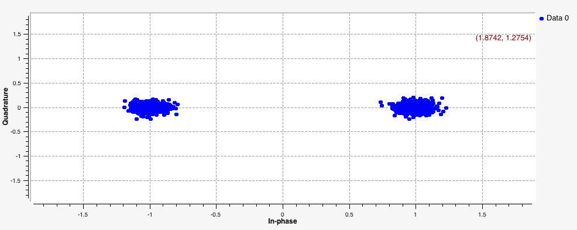
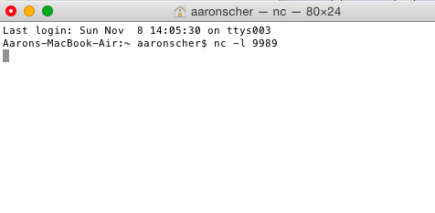
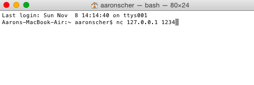

# BPSK Audio Modem in GNU Radio

**Prepared by Dr. Aaron Scher**
*Oregon Institute of Technology*

*Last updated: October 2015*

## Overview

This tutorial demonstrates how to construct a simple BPSK (Binary Phase-Shift Keying) audio modem using GNU Radio Companion. The modem broadcasts text data via your computer's speakers, and the signal is picked up with the computer's microphone - creating a complete wireless communication system using just audio!

!!! info "What You'll Learn"
    - BPSK modulation and demodulation principles
    - GNU Radio Companion flow graph construction
    - TCP socket communication for data I/O
    - Audio-based wireless data transmission
    - Carrier synchronization and recovery

## Prerequisites

**Software Requirements:**

- GNU Radio Companion (tested with version 3.7+)
- `netcat` (`nc` or `ncat`) utility - pre-installed on macOS/Linux, available for Windows
- Working audio input/output on your computer

**Knowledge Requirements:**

- Basic understanding of modulation concepts
- Familiarity with GNU Radio Companion interface
- Basic command-line terminal usage

!!! tip "Modern GNU Radio"
    In 2026, GNU Radio 3.10+ is current. This tutorial's concepts remain valid, though some block names may have changed slightly. The flow graph file (.grc) may need minor adjustments for newer versions.

## Download

[📥 Download Flow Graph: audio_modem1.grc](assets/bpsk-audio-modem/audio_modem1.grc)

## System Architecture

### BPSK Audio Modem Flow Graph

The complete system includes both transmitter and receiver in the same flow graph:


**Key Components:**

**Transmitter Chain:**
- TCP Source (port 1234) - receives text data
- BPSK Modulator - converts bits to phase-shifted carrier
- Audio Sink - outputs signal via speakers

**Receiver Chain:**
- Audio Source - captures signal via microphone
- BPSK Demodulator - recovers bits from phase-shifted carrier
- Clock Recovery - synchronizes with incoming bit stream
- TCP Sink (port 9989) - outputs decoded text data

### Block Diagram Details



## How to Operate

Follow these steps carefully - timing matters!

### Step 1: Set Up the Client (Receiver Output)

Open a terminal window and create a client to listen on port 9989 using `netcat`:

```bash
nc -l 9989
```

Or on systems using `ncat`:

```bash
ncat -l 9989
```



This terminal will display the decoded text messages received through the audio modem.

### Step 2: Execute the GNU Radio Flow Graph

1. Open `audio_modem1.grc` in GNU Radio Companion
2. Click the **Execute** button (▶️ or F6)
3. Verify the flow graph starts without errors

!!! warning "Quick Timing"
    Proceed to Step 3 quickly after starting the flow graph! The TCP source expects a connection within a few seconds.

### Step 3: Set Up the Server (Transmitter Input)

Open another terminal window and create a server to connect to `127.0.0.1` port `1234`:

```bash
nc 127.0.0.1 1234
```



This terminal is where you'll type messages to transmit.

### Step 4: Send Data

1. In the server terminal (Step 3), type a message and press Enter
2. You should hear audio tones from your speakers (the BPSK signal)
3. The message should appear in the client terminal (Step 1) after being decoded

!!! success "It's Working!"
    If you see your typed text appearing in the client terminal (possibly with some errors), congratulations - you've successfully created a working audio modem!

## Video Demonstration

Watch the system in action:

<iframe width="560" height="315" src="https://www.youtube.com/embed/LYNg9oNtE60" frameborder="0" allowfullscreen></iframe>

## Important Notes

### Carrier Lock Behavior

!!! warning "Continuous Transmission Required"
    If you stop sending data, the transmitter will stop transmitting and the receiver will lose carrier lock. When you send the next message burst:

    - The receiver needs time to reacquire lock
    - The beginning of your message may be corrupted or lost
    - For best results, maintain a continuous data stream or send periodic keep-alive characters

### Troubleshooting

**Common Issues:**

| Problem | Solution |
|---------|----------|
| No audio output | Check speaker volume and audio sink device selection in GRC |
| No data received | Verify microphone is working and not muted |
| TCP connection fails | Start the client (Step 1) before running the flow graph |
| Garbled output | Reduce speaker volume or increase microphone distance |
| Flow graph won't start | Check for missing GNU Radio blocks, update to compatible version |

**Connection Timing Issues:**

Sometimes the TCP connections don't establish on the first try. If this happens:

1. Stop the flow graph (Stop button in GRC)
2. Close both terminal windows
3. Restart from Step 1
4. Be quicker with Step 3 after starting the flow graph

## Understanding BPSK Modulation

BPSK (Binary Phase-Shift Keying) encodes data by shifting the phase of a carrier wave:

- **Bit 0**: Carrier phase = 0°
- **Bit 1**: Carrier phase = 180°

**Advantages:**
- Simple to implement
- Robust against noise
- Works well for audio frequencies
- Easy to visualize on oscilloscope

**Disadvantages:**
- Lower data rate than higher-order PSK (QPSK, 8PSK)
- Requires carrier synchronization
- Susceptible to phase ambiguity (needs differential encoding)

## Enhancements & Experiments

!!! tip "Try These Modifications"
    1. **Add Error Detection**: Insert a CRC32 block before modulation and after demodulation
    2. **Increase Data Rate**: Increase the symbol rate (reduce samples per symbol)
    3. **Add Filters**: Insert Low Pass Filters to reduce bandwidth
    4. **Visualize Signals**: Add scope sinks to observe:
       - Time domain waveform
       - Constellation diagram
       - Eye diagram
    5. **File Transfer**: Replace TCP Source with File Source to transmit files
    6. **Two-Computer Setup**: Run transmitter on one computer, receiver on another (speakers near microphone)

## Advanced Topics

### Symbol Timing Recovery

The receiver uses a timing recovery block to synchronize with the transmitter's symbol rate. Key parameters:

- **Loop Bandwidth**: Controls how quickly timing adjusts (trade-off: fast acquisition vs. stability)
- **Damping Factor**: Controls oscillation in the timing loop
- **Samples Per Symbol**: Must match transmitter setting

### Carrier Frequency Offset

In acoustic channels, slight frequency differences between transmitter and receiver can occur due to:

- Sound card sample rate differences
- Doppler effect (if devices are moving)
- Temperature-dependent oscillator drift

The Costas Loop or PLL block handles frequency offset correction.

## Real-World Applications

Acoustic modems are used in:

- **Underwater Communications**: Submarines, ocean sensors, ROVs
- **Ultrasonic Data Transfer**: Near-field communication, pairing devices
- **Industrial Control**: Noisy environments where RF is unreliable
- **Accessibility**: Audio-based data for visually impaired users
- **Education**: Teaching modulation concepts with immediate feedback

## Related GNU Radio Examples

Explore these related projects:

- **QPSK Audio Modem**: Higher data rate using 4-level phase modulation
- **FSK Audio Modem**: Frequency-shift keying for better noise immunity
- **OFDM**: Multi-carrier modulation for frequency-selective channels
- **Packet Radio**: Add framing, headers, and error correction

## References & Further Reading

- [GNU Radio Tutorials](https://wiki.gnuradio.org/index.php/Tutorials)
- [Digital Modulation Fundamentals](https://www.mathworks.com/help/comm/digital-modulation.html)
- [PSK Modulation Theory](https://en.wikipedia.org/wiki/Phase-shift_keying)
- Proakis & Salehi, "Digital Communications" (textbook)

## Conclusion

This BPSK audio modem demonstrates fundamental concepts in digital communications:

✅ **Modulation/Demodulation**
✅ **Carrier Synchronization**
✅ **Symbol Timing Recovery**
✅ **Wireless Data Transfer**

The skills learned here apply directly to RF communications, satellite links, and modern wireless standards (WiFi, LTE, 5G) - all use variations of PSK modulation!

---

*Tutorial created October 2015 | Concepts remain current in 2026*
