# Positive Coupling, Negative Coupling, and All That

## Introduction

In the world of microwave filter design you hear a lot about *coupling*:
"coupling matrices", "dual-mode coupling", "cross-coupling", "coupled-lines", "coupling screws", etc.

What is all this coupling going on? Generally speaking, the word "coupling" refers to the transfer of energy between two or more physical states or systems. This is a broad definition, and, as such, you could technically say your brain-eye is electromagnetically coupled to the distant stars when you look up on a clear starry night; or, for that matter, that you are coupled to the hand of Van Gogh when you enjoy his swirling painting *The Starry Night*. However, these are examples of one-way coupling. You have no effect on a distant star whatsoever - if it even still exists today - and you certainly have no effect on Van Gogh. Ordinarily, people use the word "coupling" to describe systems interacting more intimately with each other, pushing and pulling, exchanging energy back and forth. People generally talk about coupling between oscillators (or resonant systems).

<figure markdown="span">
{ width="400" }
<figcaption>Figure 1. <em>Starry Night</em> by Vincent van Gogh.</figcaption>
</figure>

The classic example of coupling between oscillators is two simple mechanical pendula joined by a spring, as illustrated below. If you get one pendulum swinging it will push and pull on the connecting spring, giving the second pendulum a small tug. As a result, the second pendulum begins to swing too. If the two pendulums have the same length and mass, the second pendulum continues to swing with ever greater speed as the first pendulum slows down. Eventually, the first pendulum is brought to rest; it has transferred all of its energy to the second pendulum. But now the original situation is exactly reversed, and the first pendulum is positioned to steal back its energy from the second. The process repeats itself over and over, with energy being passed back and forth like a game of catch, until finally all the energy is dissipated as heat by friction and air resistance. When this happens all mechanical motion ceases.

<figure markdown="span">
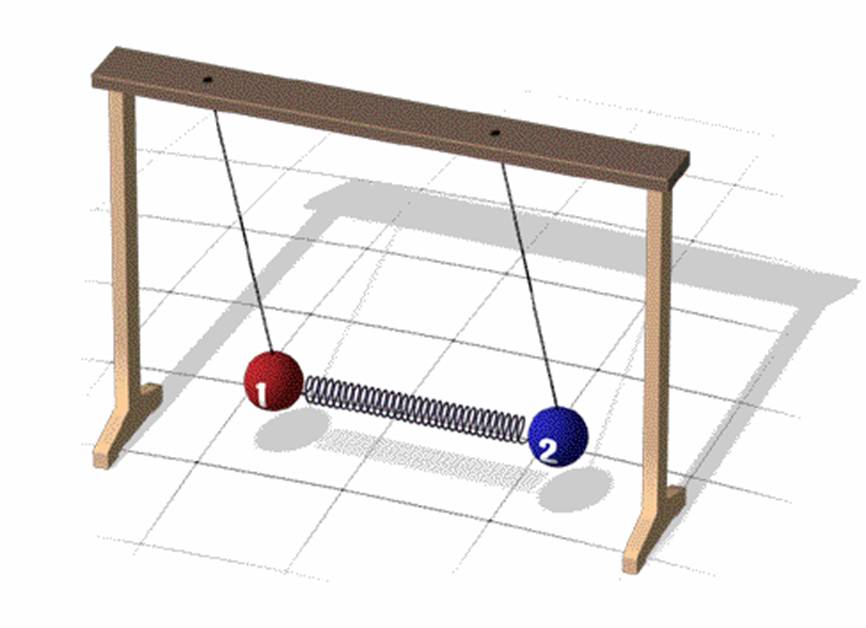{ width="400" }
<figcaption>Figure 2. Two pendula joined by a spring.</figcaption>
</figure>

---

## Synchronously Tuned Coupled-Resonator Circuits

The electronic analog of the two pendula joined by a spring is a circuit composed of two resonators joined by a coupling element. Energy is coupled in the circuit, not by mechanical springs of course, but by electric and magnetic fields, or a mixture thereof.

Consider two lossless identical resonators, each with a self-inductance $L$ and self-capacitance $C$, existing independently from one another as illustrated in Figure 3(a). The resonant frequency $\omega_0$ of each resonator is related to $L$ and $C$ by the well-known relation $\omega_0 = 1/\sqrt{LC}$. As it stands, the resonators have nothing to do with each other, and are completely decoupled. Now suppose that the resonators are brought together to "share" a little piece of their self-inductance with one another. Suppose this little piece of shared inductance has value $L_m$ (where $L_m \leq L$) as illustrated in Figure 3(b). In this new situation, the resonators are said to be **shunt inductively coupled**. Alternate forms of the equivalent circuit are illustrated in Figure 3(c); these are particularly convenient for design applications.

<figure markdown="span">
{ width="400" }
<figcaption>(a) Two separate resonators existing independently from one another.</figcaption>
</figure>

<figure markdown="span">
{ width="250" }
<figcaption>(b) The resonators are brought together to "share" a piece of their inductance $L_m$, forming a coupled pair of $LC$ resonators.</figcaption>
</figure>

<figure markdown="span">
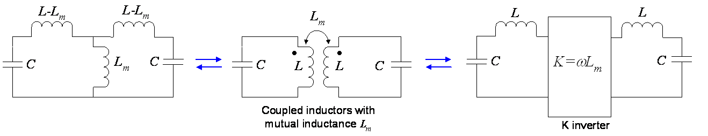{ width="800" }
<figcaption>(c) Alternative forms of the equivalent circuit (all three have equal loop currents and resonant frequencies).</figcaption>
</figure>

*Figure 3. The formation of a shunt inductively coupled pair of LC resonators.*

While each isolated $LC$ resonator supports only one resonant mode individually, the coupled pair as a whole supports two - each with its own resonant frequency. To understand this, consider the form of the coupled pair shown in Figure 4, where we denote the currents in loops 1 and 2 as $I_1$ and $I_2$, respectively. Here we use capital letters for current to remind us that we are dealing with phasor representations in the frequency domain; as usual, lower-case letters are reserved for time domain variables.

<figure markdown="span">
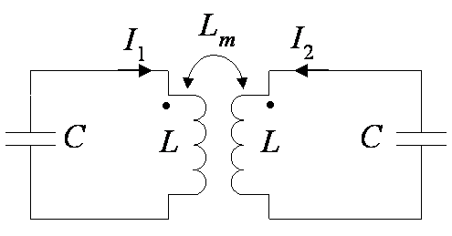{ width="400" }
<figcaption>Figure 4. Schematic of coupled pair showing currents $I_1$ and $I_2$ for deriving the coupling equations.</figcaption>
</figure>

The coupling equations describing this network are:

$$
j\omega L \, I_1 - j\frac{I_1}{\omega C} + \underbrace{j\omega L_m \, I_2}_{\text{coupling: } I_2 \text{ induces voltage in loop 1}} = 0 \tag{1}
$$

$$
j\omega L \, I_2 - j\frac{I_2}{\omega C} + \underbrace{j\omega L_m \, I_1}_{\text{coupling: } I_1 \text{ induces voltage in loop 2}} = 0 \tag{2}
$$

In matrix form, these equations become:

$$
\begin{bmatrix} j\!\left(\omega L - \dfrac{1}{\omega C}\right) & j\omega L_m \\[8pt] j\omega L_m & j\!\left(\omega L - \dfrac{1}{\omega C}\right) \end{bmatrix} \begin{bmatrix} I_1 \\ I_2 \end{bmatrix} = 0 \tag{3}
$$

An easy and obvious solution to this matrix equation is simply $I_1 = I_2 = 0$. However, this is not a very interesting solution. In fact, a resonant mode is precisely the situation when the currents are *not* zero. For this to be the case, the 2-by-2 square matrix on the left hand side of Eq. (3) must be non-invertible (i.e. it must be singular). Recall from basic linear algebra that a square matrix is singular if and only if its determinant is equal to zero. Singular matrices are rare in the sense that if you pick a random square matrix, it will almost surely not be singular. However, at certain frequencies (which we identify as the resonant frequencies) the matrix on the left hand side of Eq. (3) will indeed be singular. To find these resonant frequencies, we take the determinant and set it equal to zero:

$$
\begin{vmatrix} j\!\left(\omega L - \dfrac{1}{\omega C}\right) & j\omega L_m \\[8pt] j\omega L_m & j\!\left(\omega L - \dfrac{1}{\omega C}\right) \end{vmatrix} = \left(\omega L - \frac{1}{\omega C}\right)^2 - (\omega L_m)^2 = 0 \tag{4}
$$

If you crank through the algebra, you will find that this equation has two positive real solutions $\omega_m$ and $\omega_e$, where

$$
\omega_e = \frac{1}{\sqrt{(L - L_m)\,C}} \tag{5}
$$

$$
\omega_m = \frac{1}{\sqrt{(L + L_m)\,C}} \tag{6}
$$

The larger the magnetic coupling $L_m$, the greater the resonant frequencies $\omega_e$ and $\omega_m$ "split away" from that of an uncoupled resonator $\omega_0$. On the other hand, in the limit that the coupling is zero, the solutions tend to that of an uncoupled single resonator, i.e. $\omega_e = \omega_m = \omega_0 = 1/\sqrt{LC}$ when $L_m = 0$.

What about the currents $I_1$ and $I_2$ in all of this? If you substitute $\omega = \omega_e$ into Eq. (1) or (2), you will find that $I_1 = -I_2$. This means the common current through the "shared" inductance $L_m$ is $I_1 + I_2 = I_1 - I_1 = 0$. From the point of view of the loop current voltages, this condition is equivalent to replacing the symmetry plane between the coupled pair with an **electric wall** (i.e. a short). The symmetry plane is illustrated in Fig. 5. The subscript "$e$" in the symbol $\omega_e$ stands for "electric wall". This mode is referred to as the *odd* mode.

On the other hand, if you substitute $\omega = \omega_m$ into Eq. (1) or (2), you will find that $I_1 = I_2$. This means the common current through the "shared" inductance $L_m$ is $I_1 + I_2 = 2I_1 = 2I_2$. This condition is equivalent to replacing the symmetry plane with a **magnetic wall** (i.e. an open). This mode is referred to as the *even* mode. The subscript "$m$" in the symbol $\omega_m$ stands for "magnetic wall".

!!! info "Summary of Even/Odd Mode Properties"

    | Mode | Condition | Symmetry Plane | Frequency |
    |------|-----------|---------------|-----------|
    | Odd (electric wall) | $I_1 = -I_2$ | Short circuit | $\omega_e = 1/\sqrt{(L - L_m)C}$ |
    | Even (magnetic wall) | $I_1 = +I_2$ | Open circuit | $\omega_m = 1/\sqrt{(L + L_m)C}$ |

<figure markdown="span">
{ width="400" }
<figcaption>Figure 5. Symmetry plane between the coupled resonant pair.</figcaption>
</figure>

An important fact to take away from all this is that a coupled pair of resonators forms a composite system with two resonant modes of its own. The resonant frequencies of these modes are different from that of the uncoupled single resonators. You can say that the original mode has "split" into two. This is a general fact of coupled oscillators: a system composed of $N$ weakly coupled discrete oscillators will in general have $N$ independent states ("state" is a more general term for "mode"). If you increase $N$, then the number of states goes up. Recall that a single pendulum swings back and forth with one frequency only - its resonant frequency. Here we have $N = 1$. On the other hand, consider a guitar string fixed on both ends. Such a structure basically consists of an infinite number of coupled oscillators (i.e. the atoms in the string coupled together by electrostatic forces). As you may know, an ideal vibrating string fixed on both ends has an infinite number of sine waves (i.e. modes or harmonics) it can support. Strum an acoustic guitar to hear some of them.

<figure markdown="span">
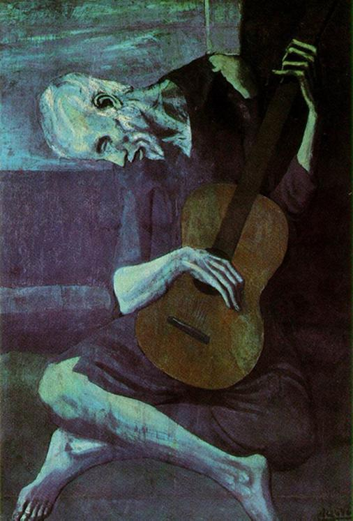{ width="300" }
<figcaption>Figure 6. <em>The Old Guitarist</em> by Pablo Picasso.</figcaption>
</figure>

---

## Negative Coupling

The mutual inductance $L_M$ can be either positive or negative depending on the polarity of the mutual voltage in reference to the direction of the inducing current. Figure 7 shows two magnetically coupled coils with both positive and negative coupling. Note that the mutual voltage in the second coil can be positive or negative based on the orientation of the coils. The figures assume the **dot convention**: if a current *enters* the dotted terminal of a coil, the reference polarity of the voltage induced in the other coil is positive at its dotted terminal. If a current *leaves* the dotted terminal of a coil, the reference polarity of the voltage induced in the other coil is negative at its dotted terminal.

<figure markdown="span">
{ width="500" }
<figcaption>Figure 7. Illustration of sign convention for the mutual inductance $L_m$. (a) $L_m > 0$, (b) $L_m < 0$. In these illustrations, the terminals at port 2 are open so no current flows through them.</figcaption>
</figure>

As it turns out, we are not so much interested in the mutual inductance $L_m$ itself as we are in the ratio of mutual inductance to self-inductance: $L_m / L$. This ratio is a measure of the coupling strength, and is known as the **coupling coefficient** $k_M$ for a pair of synchronously tuned shunt inductive coupled resonators. From energy considerations, it can be shown that the mutual inductance of a pair of coils cannot be greater than the geometric mean of the self-inductances of the coils:

$$
|L_M| \leq \sqrt{L_1 L_2}
$$

In this manner, the coupling coefficient $k_M$ specifies the extent to which $L_M$ approaches the upper limit, and satisfies the inequality:

$$
-1 \leq k_M \leq 1
$$

The general coupling coefficient $k$ between any two resonators is defined based on the ratio of coupled energy to stored energy of the electromagnetic field. The coupling coefficient shows up all the time in filter theory. When people talk about "coupling matrices" of microwave bandpass filters, they really mean a matrix (as in a two-dimensional array of numbers) filled with the coupling coefficients between the various resonators of the filter.

A nice feature of the coupling coefficient is that it can be found from the even and odd mode resonant frequencies, $\omega_m$ and $\omega_e$. From Eqs. (5) and (6) we have:

$$
k_M \equiv \frac{L_m}{L} = \frac{\omega_e^2 - \omega_m^2}{\omega_e^2 + \omega_m^2} \tag{7}
$$

So, by our chosen sign convention, if $\omega_e > \omega_m$ then $k_M$ is positive, and if $\omega_e < \omega_m$ then $k_M$ is negative. This sign convention is as arbitrary as assigning a *negative* electric charge to an electron and a *positive* electric charge to a proton. But once the sign convention has been made, you must stick with it or else you will lose your way. In order to ensure this sign convention is satisfied every time, we define the general coupling coefficient $k$ to be:

$$
k \equiv \frac{\omega_e^2 - \omega_m^2}{\omega_e^2 + \omega_m^2} \tag{8}
$$

Equation (8) satisfies the strict definition of $k$ (see Hong and Lancaster [^1]). This is a powerful equation that can be used to experimentally or numerically determine the coupling coefficient between any two synchronously tuned pair of resonators - no matter what the type of coupling.

[^1]: J.-S. Hong and M. J. Lancaster, *Microstrip Filters for RF/Microwave Applications*, Wiley, 2001.

---

## Basic Coupling Mechanisms

The basic coupling mechanisms between synchronously tuned pairs of resonators are summarized below. For each type of coupling, we show the coupling equations, the even and odd resonant frequencies (denoted $\omega_e$ and $\omega_m$, respectively), and the coupling coefficient - all in terms of the lumped element values.

<figure markdown="span">
{ width="750" }
</figure>

<figure markdown="span">
{ width="750" }
</figure>

<figure markdown="span">
{ width="750" }
<figcaption>Figure 8. Basic coupling mechanisms: shunt inductive (top), series capacitive (middle), and mixed (bottom).</figcaption>
</figure>

---

## A Practical Way to Extract the Coupling Coefficient

Suppose you had two coupled resonators and you wanted to know the value of the coupling coefficient. We can use Eq. (8) to extract $k$ if we know the two eigenfrequencies $\omega_m$ and $\omega_e$. One easy way to determine the eigenfrequencies is to very lightly "excite" the system with a voltage source like that shown in Figure 9, and then measure the voltage or current at some other point in the circuit. The eigenfrequencies will be apparent.

Figure 9 shows a SPICE schematic with two LC resonators inductively coupled with $k_M = 0.1$. We loosely couple a voltage source to resonator 1 (via a small capacitor) and loosely couple a resistor to resonator 2 (via a second small capacitor). Figure 10 shows the measured voltage across R1. Here we clearly see two resonant peaks at $f_1 = 49.364$ kHz and $f_2 = 54.573$ kHz. The phase of the voltage is positive 90 degrees, which tells us that the coupling is positive, and therefore inductive (more on that in the next section). Substituting $f_1$ and $f_2$ into Equation (8) yields:

$$
k = \frac{f_2^2 - f_1^2}{f_2^2 + f_1^2} = \frac{54.573^2 - 49.364^2}{54.573^2 + 49.364^2} = 0.1000
$$

which is equal to the known value of $k_M$. Note that the stronger the coupling, the wider the frequency gap between the resonant peaks. This translates to the language of bandpass filter design as: "the wider the bandwidth, the tighter the required coupling between resonators."

<figure markdown="span">
{ width="500" }
<figcaption>Figure 9. LTspice schematic depicting measurement setup for extracting coupling coefficient.</figcaption>
</figure>

<figure markdown="span">
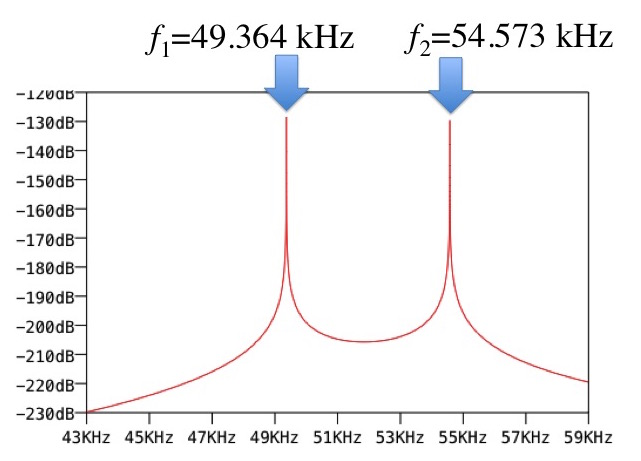{ width="400" }
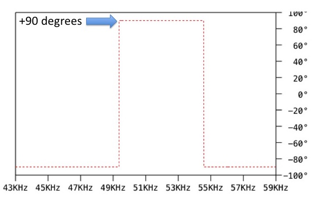{ width="400" }
<figcaption>Figure 10. SPICE simulation results. Magnitude and phase of voltage across 100 &Omega; load resistor.</figcaption>
</figure>

---

## Electric Coupling is Negative Coupling

Or is it positive? Some people refer to electric (aka "series capacitive") coupling as "negative" coupling. To get a better understanding of this, refer to Figure 11. Here we see that two LC resonant circuits capacitively coupled are equivalent to two LC resonant circuits inductively coupled with a negative mutual inductance (here we consider the mutual inductance as negative because the "dotted" terminals are on opposite sides). We say these two circuits are equivalent in the sense that they have the same eigenfrequencies (resonant frequencies) and almost identical phase response near resonance. Figure 12 shows a SPICE schematic and simulation to illustrate how well this equivalence holds in a typical situation. The sign of coupling is rather relative. It's similar to how we assign an electron as being "negatively" charged.

Notice how the phase in Figure 13 is $-90°$ between the resonant peaks. This "gives away" the sign of the coupling as negative. If the phase were $+90°$ then the sign of coupling would be considered "positive". Some people reverse what is positive and negative. Luckily, it makes no difference so long as a convention is established and you stick with that convention.

<figure markdown="span">
{ width="500" }
<figcaption>Figure 11. Capacitive coupling is equivalent to negative inductive coupling. Note: This equality is not exact! It works best with light loading (high Q) and loose coupling.</figcaption>
</figure>

<figure markdown="span">
{ width="700" }
<figcaption>Figure 12. SPICE schematic to demonstrate the equivalence shown in Figure 11.</figcaption>
</figure>

<figure markdown="span">
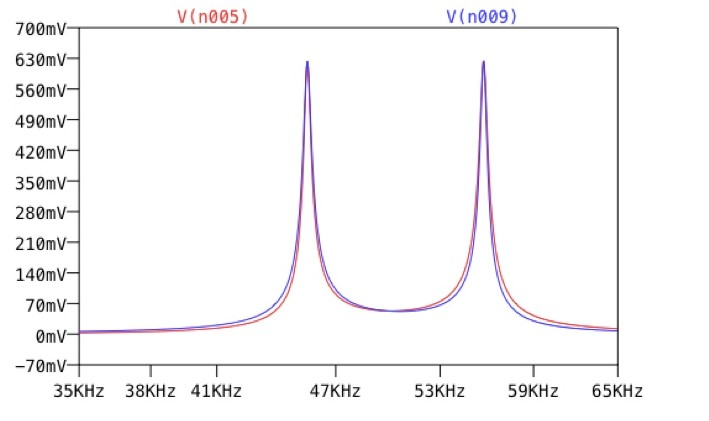{ width="400" }
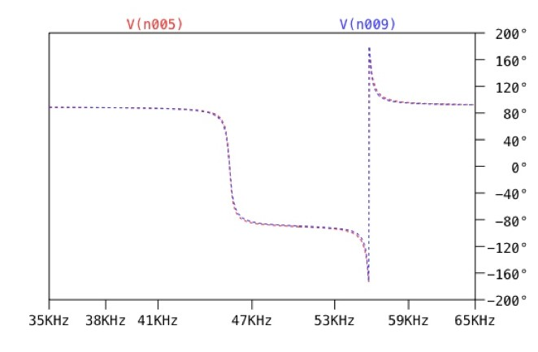{ width="400" }
<figcaption>Figure 13. SPICE simulation results. Magnitude and phase of voltage across 0.5 &Omega; load resistor.</figcaption>
</figure>

---

## Sum the Electric and Magnetic Couplings to Find the Total Coupling

Two coupled resonators with mixed coupling are approximately equivalent to two coupled resonators with purely capacitive or purely inductive coupling. This is illustrated in Figures 14 and 15. This equivalence only holds for very loose coupling (which is assumed in narrowband microwave filter design). To illustrate this, Figure 16 shows SPICE schematics comparing the mixed coupling case to the pure inductive and pure capacitive cases. Figure 17 shows simulated output voltage. Note the very good agreement between the mixed coupling case and that of pure inductive and pure capacitive coupling.

<figure markdown="span">
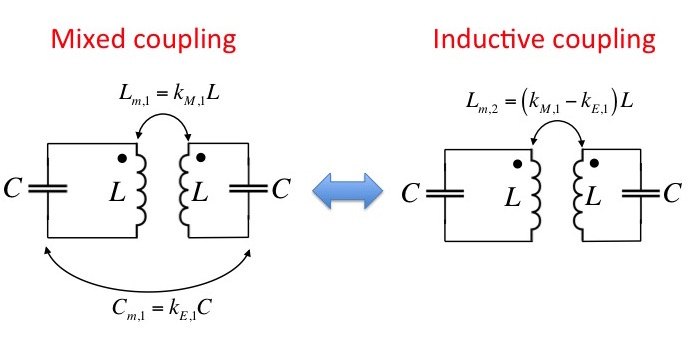{ width="700" }
<figcaption>Figure 14. Mixed coupling is equal to inductive coupling near resonance (loose coupling assumed).</figcaption>
</figure>

<figure markdown="span">
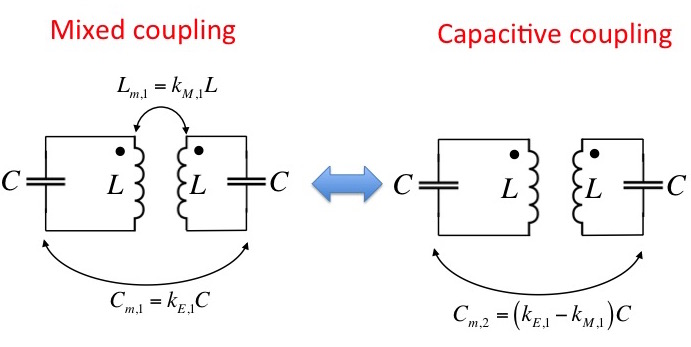{ width="700" }
<figcaption>Figure 15. Mixed coupling is equal to capacitive coupling near resonance (loose coupling assumed).</figcaption>
</figure>

<figure markdown="span">
{ width="600" }
<figcaption>Figure 16. SPICE schematics demonstrating the equivalences shown in Figures 14 and 15.</figcaption>
</figure>

<figure markdown="span">
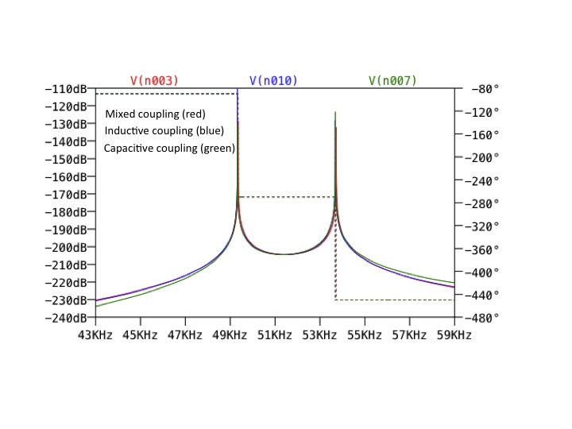{ width="700" }
<figcaption>Figure 17. SPICE simulation results.</figcaption>
</figure>
