# Resonant Coupling Networks

Below are a collection of images and figures of circuit transforms, examples, and theorems regarding resonant coupling networks, with a focus on magnetic coupling.

## References

1. K. Clarke, et al., *Communication Circuits: Analysis and Design*, 1971
2. H. Krauss, et al., *Solid State Radio Engineering*, 1980
3. J. Carr, *Secrets of RF Circuit Design*, 1991

---

## Equivalent Circuits and Transformers

<figure markdown="span">
{ width="700" }
<figcaption>Figure 1. High Q approximate equivalent circuits for various parallel, resonant "transformer-like" networks.</figcaption>
</figure>

<figure markdown="span">
{ width="700" }
<figcaption>Figure 2. Ideal transformer circuit relationships.</figcaption>
</figure>

<figure markdown="span">
{ width="700" }
<figcaption>Figure 3. Coupled inductor equivalent circuits in terms of magnetizing and leakage inductances.</figcaption>
</figure>

<figure markdown="span">
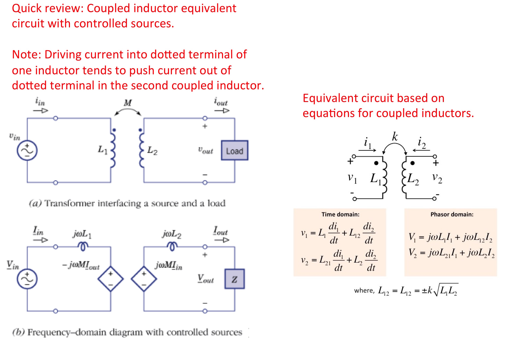{ width="700" }
<figcaption>Figure 4. Another coupled inductor equivalent circuit in terms of controlled sources.</figcaption>
</figure>

<figure markdown="span">
{ width="700" }
<figcaption>Figure 5. Coupled inductor impedance transformation.</figcaption>
</figure>

<figure markdown="span">
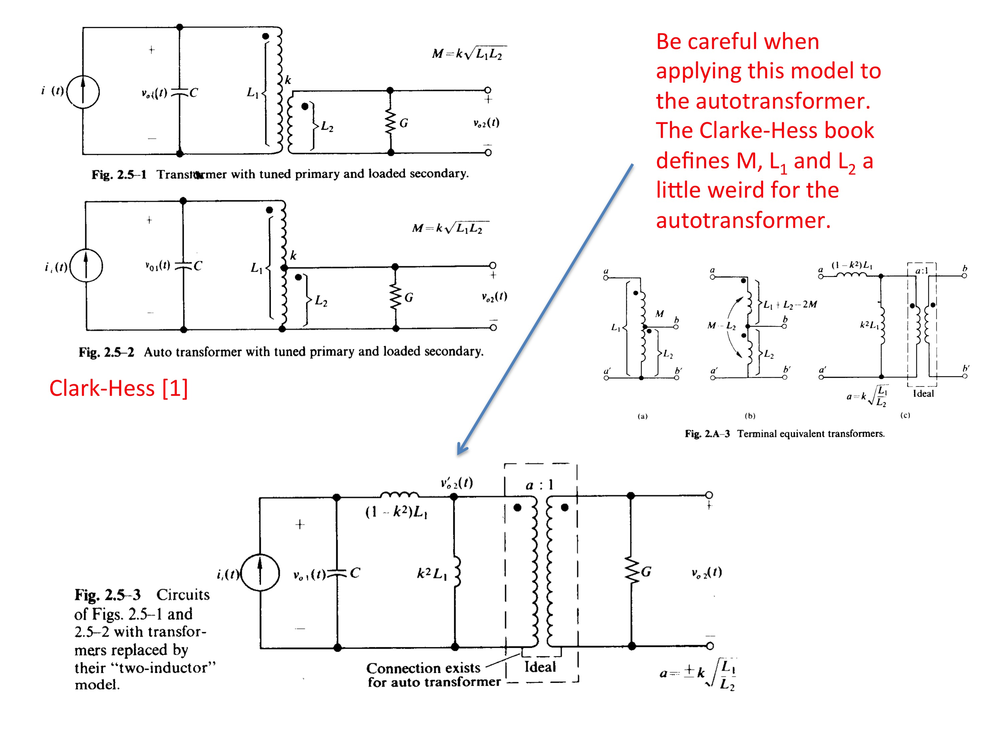{ width="700" }
<figcaption>Figure 6. Coupled inductor equivalent circuits for transformer and autotransformer in terms of magnetizing and leakage inductances.</figcaption>
</figure>

---

## Auto-Transformers and Tapped Inductors

<figure markdown="span">
{ width="700" }
<figcaption>Figure 7. Auto-transformer equivalent circuits.</figcaption>
</figure>

<figure markdown="span">
{ width="700" }
<figcaption>Figure 8. Tapped inductor (auto-transformer) impedance.</figcaption>
</figure>

<figure markdown="span">
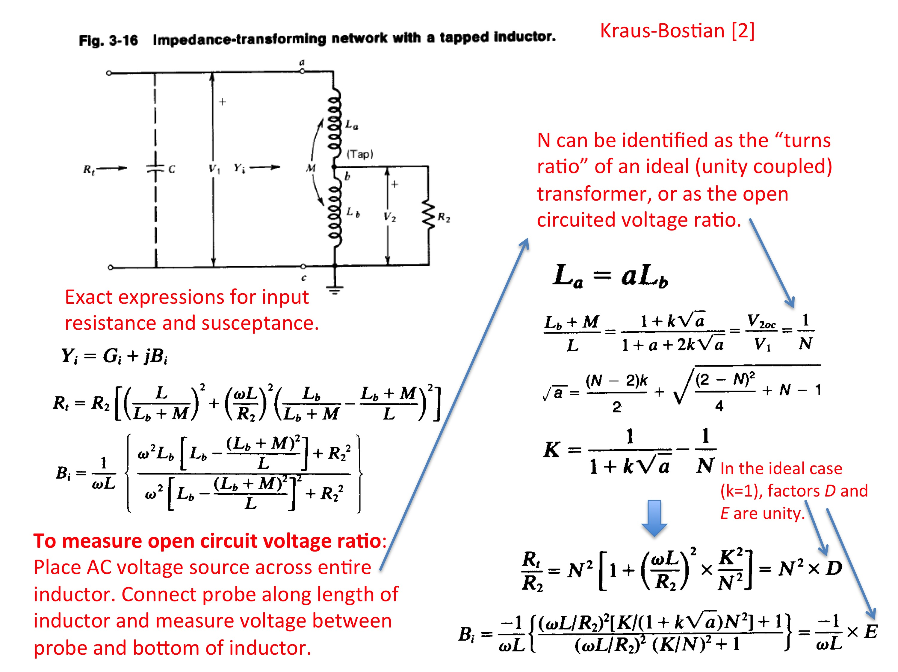{ width="700" }
<figcaption>Figure 9. Non-ideal tapped inductor (auto-transformer) equivalent input impedance.</figcaption>
</figure>

<figure markdown="span">
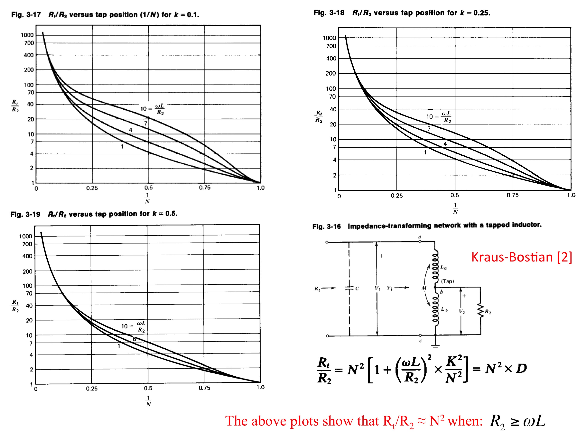{ width="700" }
<figcaption>Figure 10. Non-ideal tapped inductor (auto-transformer) characteristics.</figcaption>
</figure>

<figure markdown="span">
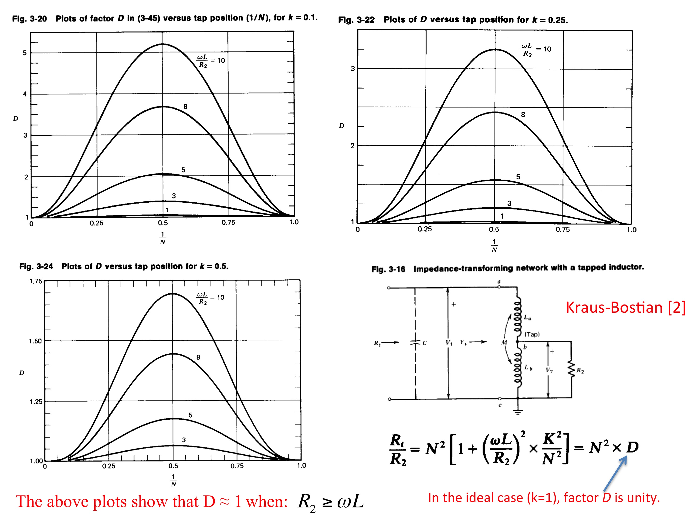{ width="700" }
<figcaption>Figure 11. Non-ideal tapped inductor (auto-transformer) characteristics.</figcaption>
</figure>

<figure markdown="span">
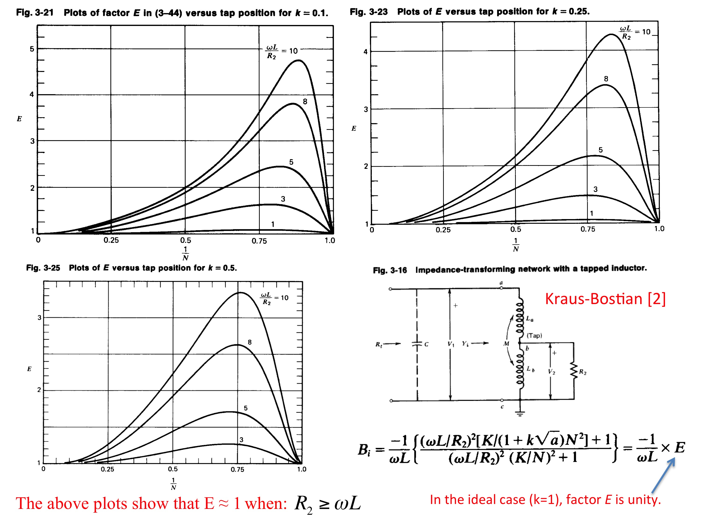{ width="700" }
<figcaption>Figure 12. Non-ideal tapped inductor (auto-transformer) characteristics.</figcaption>
</figure>

---

## Series Inductors and Decomposition

<figure markdown="span">
{ width="500" }
<figcaption>Figure 13. Equivalent circuit of two coupled inductors connected in series.</figcaption>
</figure>

<figure markdown="span">
{ width="700" }
<figcaption>Figure 14. Just for fun: Decompose a single inductor into two coupled inductors in series.</figcaption>
</figure>

---

## Parallel-Series Conversions and RLC Properties

<figure markdown="span">
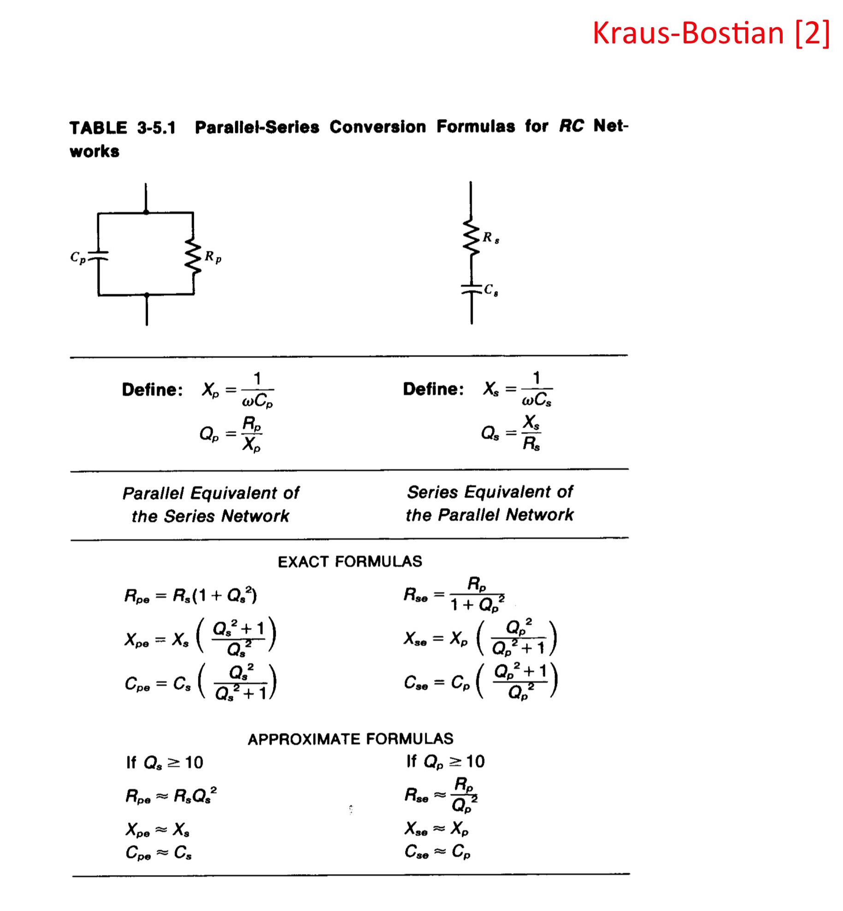{ width="700" }
<figcaption>Figure 15. Parallel-series conversion formulas for RC networks.</figcaption>
</figure>

<figure markdown="span">
{ width="700" }
<figcaption>Figure 16. Parallel-series conversion formulas for RL networks.</figcaption>
</figure>

<figure markdown="span">
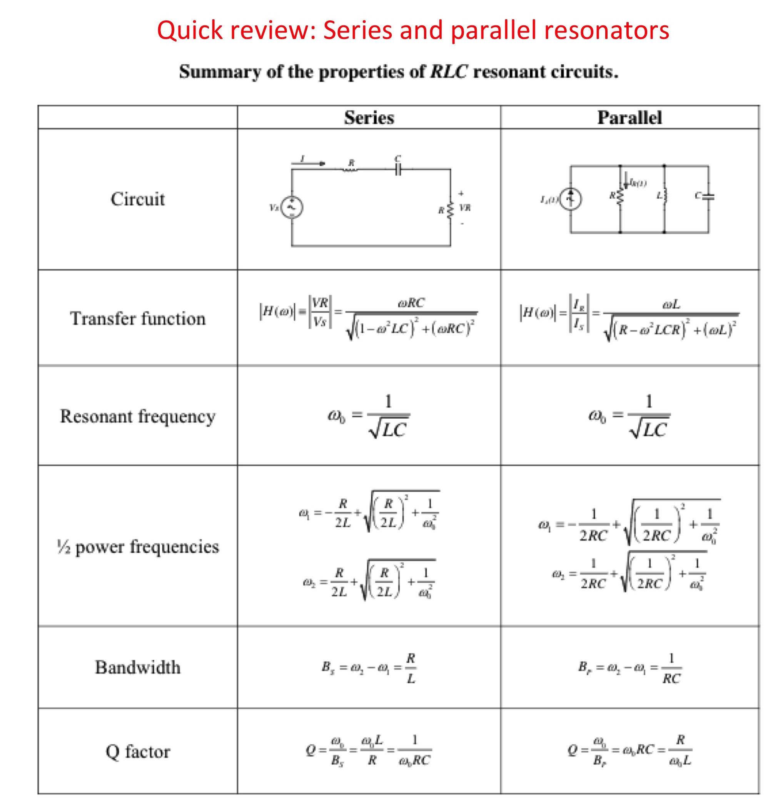{ width="700" }
<figcaption>Figure 17. Summary of the properties of RLC resonant circuits.</figcaption>
</figure>

---

## Tapped Capacitor and Tapped Inductor Circuits

<figure markdown="span">
{ width="700" }
<figcaption>Figure 18. Design formulas for tapped capacitor circuit.</figcaption>
</figure>

<figure markdown="span">
{ width="700" }
<figcaption>Figure 19. Tapped capacitor circuit design example.</figcaption>
</figure>

<figure markdown="span">
{ width="700" }
<figcaption>Figure 20. Design formulas for tapped inductor circuit.</figcaption>
</figure>

<figure markdown="span">
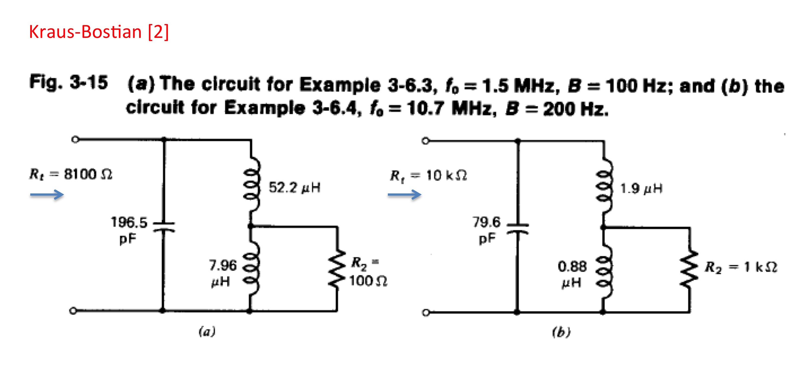{ width="700" }
<figcaption>Figure 21. Tapped inductor circuit design example.</figcaption>
</figure>

---

## Single and Double Tuned Transformers

<figure markdown="span">
{ width="700" }
<figcaption>Figure 22. Design formulas for the single tuned transformer.</figcaption>
</figure>

<figure markdown="span">
{ width="700" }
<figcaption>Figure 23. Example: Design of a tuned amplifier.</figcaption>
</figure>

<figure markdown="span">
{ width="700" }
<figcaption>Figure 24. Double tuned transformer equivalent circuit.</figcaption>
</figure>

<figure markdown="span">
{ width="700" }
<figcaption>Figure 25. Double tuned transformer equivalent circuit and insight.</figcaption>
</figure>

---

## Tank Circuits and Matching Examples

<figure markdown="span">
{ width="700" }
<figcaption>Figure 26. Popular forms of tuned RF/IF tank circuits.</figcaption>
</figure>

<figure markdown="span">
{ width="700" }
<figcaption>Figure 27. Tapped capacitor matching example.</figcaption>
</figure>

<figure markdown="span">
{ width="700" }
<figcaption>Figure 28. LTspice confirmation of previous example.</figcaption>
</figure>

<figure markdown="span">
{ width="700" }
<figcaption>Figure 29. Tapped capacitor + tapped inductor matching example.</figcaption>
</figure>

<figure markdown="span">
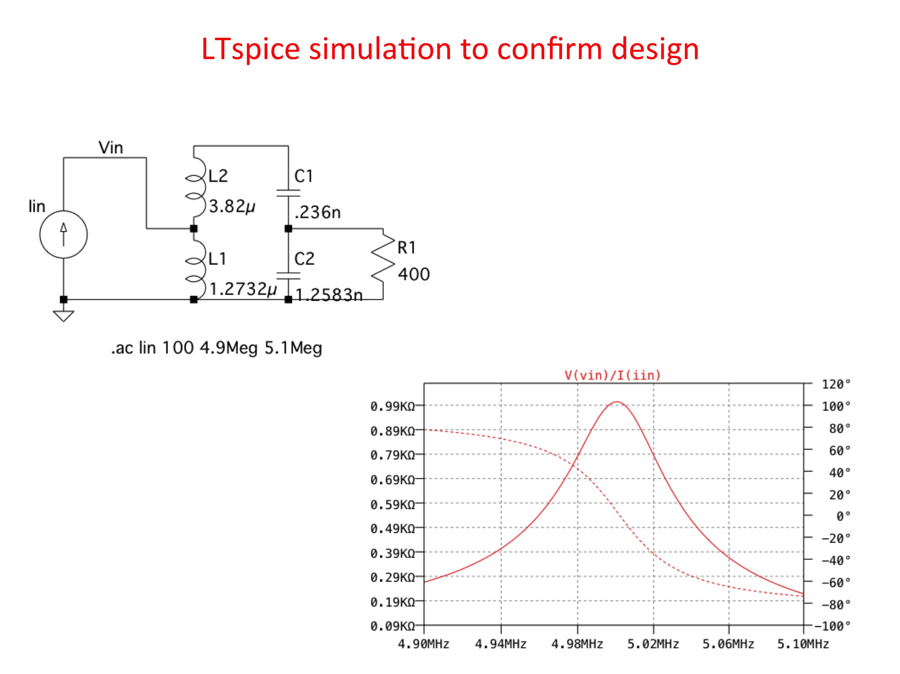{ width="700" }
<figcaption>Figure 30. LTspice confirmation of previous example.</figcaption>
</figure>

---

## Applications

<figure markdown="span">
{ width="700" }
<figcaption>Figure 31. Hi-Fi switch.</figcaption>
</figure>

<figure markdown="span">
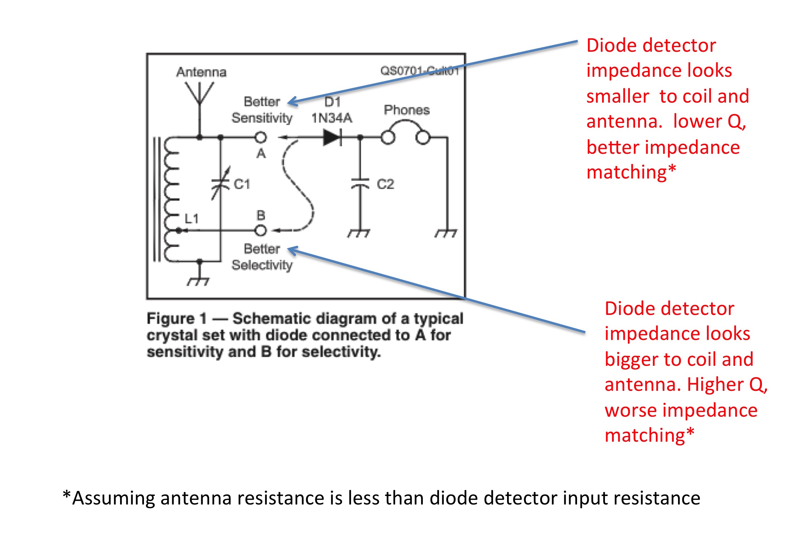{ width="700" }
<figcaption>Figure 32. Tapped capacitor crystal radio set. Sensitivity versus selectivity.</figcaption>
</figure>

---

## Filter Coupling and Multi-Stage Networks

<figure markdown="span">
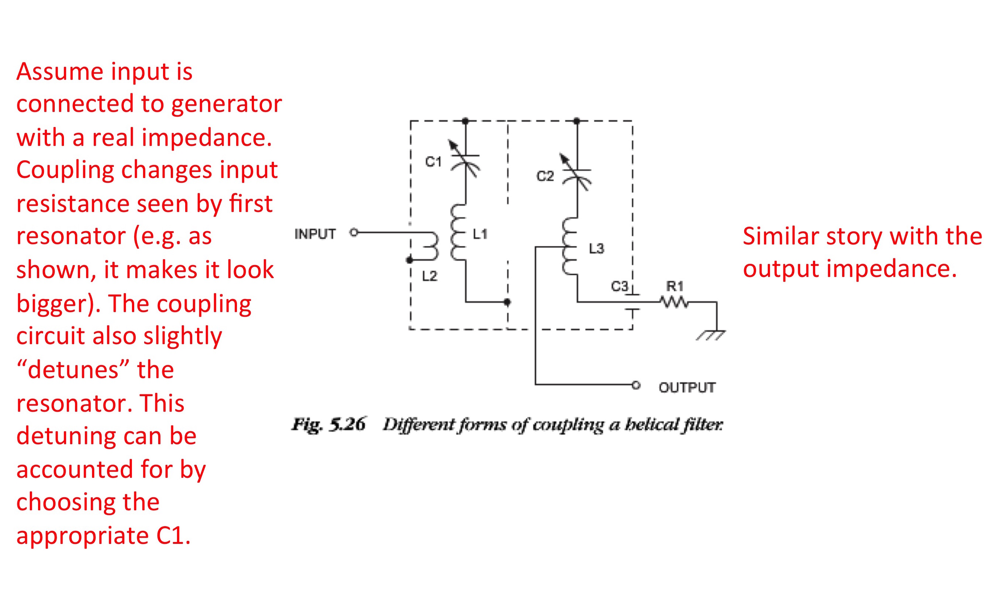{ width="700" }
<figcaption>Figure 33. Coupling into and out of a filter.</figcaption>
</figure>

<figure markdown="span">
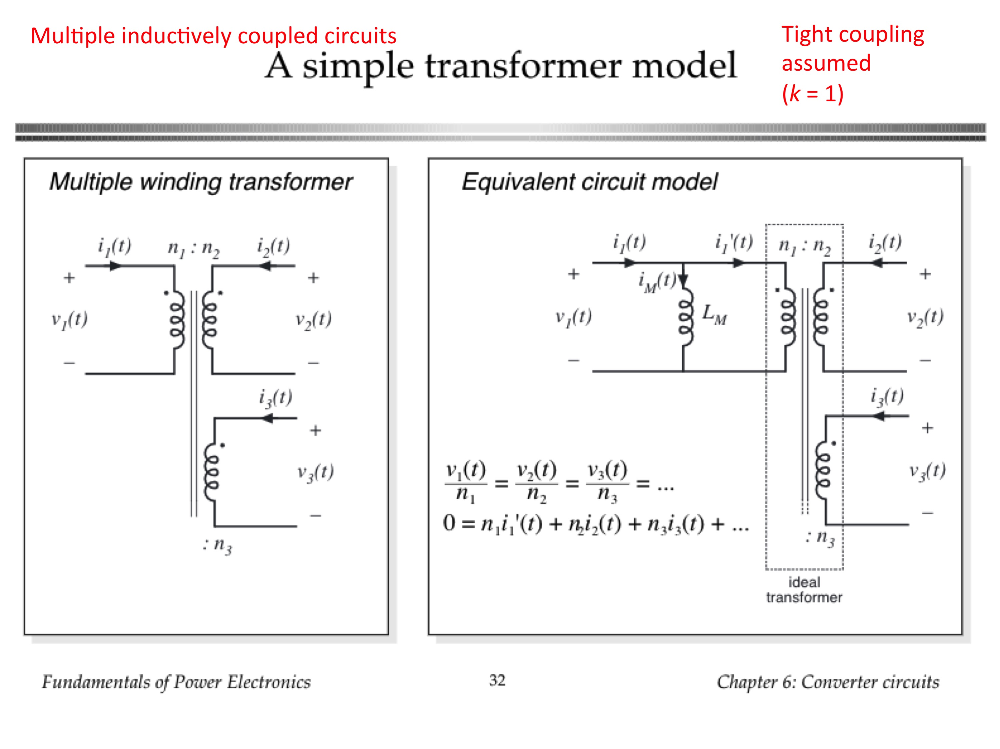{ width="700" }
<figcaption>Figure 34. Multiple transformers equivalent circuit.</figcaption>
</figure>

<figure markdown="span">
{ width="700" }
<figcaption>Figure 35. Three inductively coupled loops - equivalent circuits.</figcaption>
</figure>

---

## Time Domain and Transient Responses

<figure markdown="span">
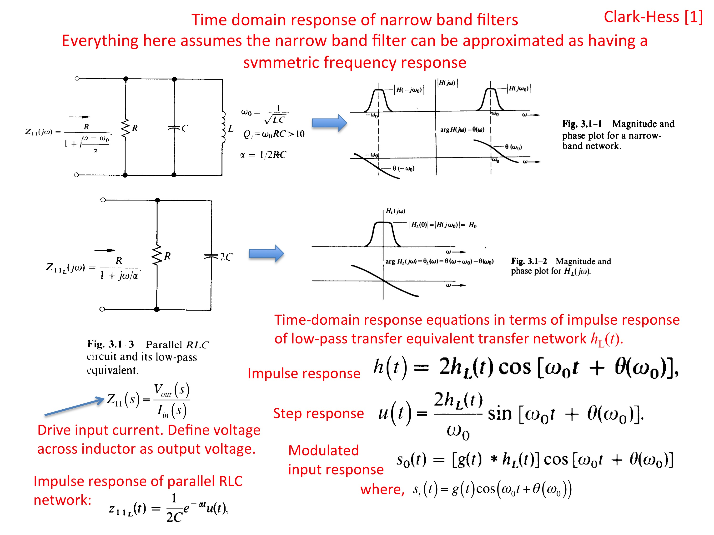{ width="700" }
<figcaption>Figure 36. Time domain response of narrow band filters.</figcaption>
</figure>

<figure markdown="span">
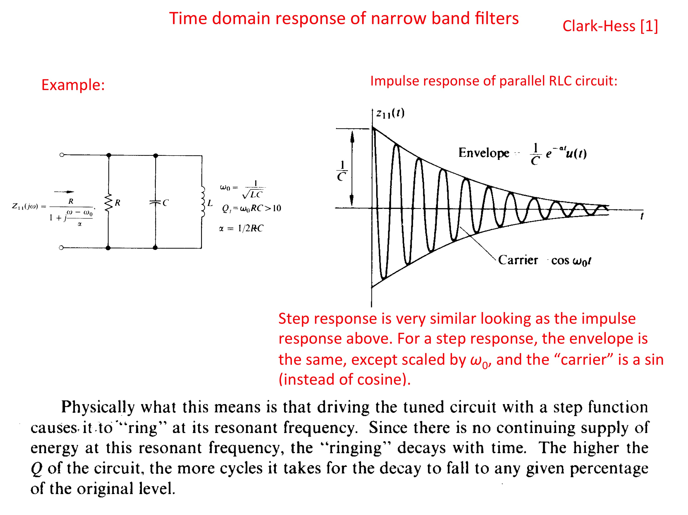{ width="700" }
<figcaption>Figure 37. Impulse response of parallel RLC circuit.</figcaption>
</figure>

<figure markdown="span">
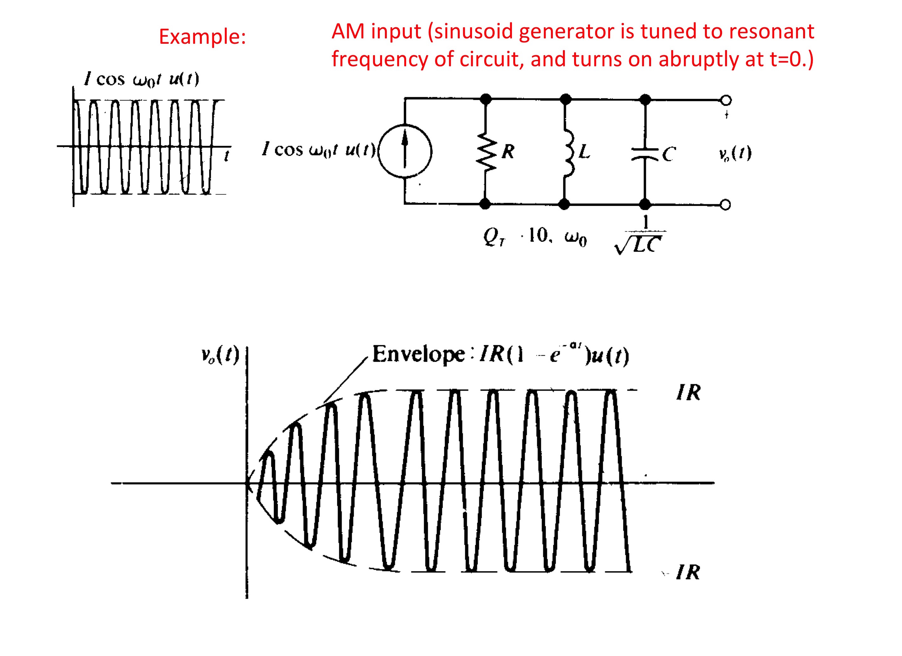{ width="700" }
<figcaption>Figure 38. Transient response of parallel RLC circuit to sinusoid input.</figcaption>
</figure>

<figure markdown="span">
{ width="700" }
<figcaption>Figure 39. Transient response of parallel RLC circuit to on-off shift keying signal.</figcaption>
</figure>

<figure markdown="span">
{ width="700" }
<figcaption>Figure 40. Narrow band filter response to periodic signal.</figcaption>
</figure>

<figure markdown="span">
{ width="700" }
<figcaption>Figure 41. Parallel RLC network response to impulse train.</figcaption>
</figure>
